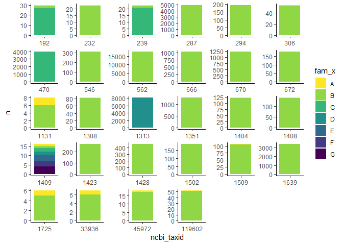
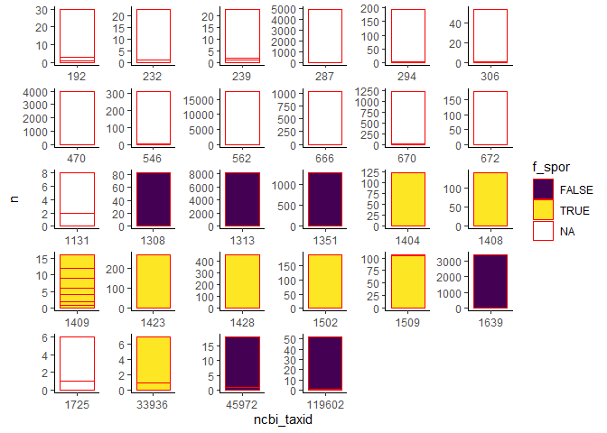

Assign host sporulation
================
Daniel Schwartz

# The Goal

After matching hosts to the viral-Refseq viruses we now assign each
viral hosts as a sporulator or non-sporulator.

# import data

-   data on hosts of refseq viruses from “A_add-host-DRAM”

-   Curated list of sporulation in families of Firmicutes.

``` r
#  data on hosts of refseq viruses
d.vir <- read_csv(here("enrichment","data/Viruses/refseq_phages_wHost.csv"))
```

    ## Rows: 3690 Columns: 35
    ## -- Column specification --------------------------------------------------------
    ## Delimiter: ","
    ## chr (14): refseq.id.x, virus.name, virus.lineage, refseq.id.y, host.name, ho...
    ## dbl (14): VIRSorter category, Prophage, Gene count, Strand switches, potenti...
    ## lgl  (7): Circular, Transposase present, KEGG.GENOME, KEGG.DISEASE, DISEASE,...
    ## 
    ## i Use `spec()` to retrieve the full column specification for this data.
    ## i Specify the column types or set `show_col_types = FALSE` to quiet this message.

``` r
# Curated list of sporulation in families of Firmicutes
fam_spor <- read_csv(here("gtdb_spor/data/gtdb_families_sporulation.csv")) %>% 
  distinct() %>% 
  mutate(gtdb_dpf = str_c(gtdb_d,gtdb_p, gtdb_f, sep = ";"))
```

    ## Rows: 402 Columns: 6
    ## -- Column specification --------------------------------------------------------
    ## Delimiter: ","
    ## chr (5): gtdb_d, gtdb_p, gtdb_c, gtdb_o, gtdb_f
    ## lgl (1): f_spor
    ## 
    ## i Use `spec()` to retrieve the full column specification for this data.
    ## i Specify the column types or set `show_col_types = FALSE` to quiet this message.

This sporulation list was prepared for GTDB taxonomy, but the hosts for
resfeq viruses are in NCBI taxonomy. I will find the GTDB taxonomy for
each of the host taxIDs.

# get gtdb data for NCBI taxIDs

Previously I downloaded the metadata of gtdb. I next pull from there all
data that has NCBI taxIDs matching assigned hosts of refseq phages

``` r
# get gtdb by NCBI taxID

f_meta <- list.files(here("gtdb_spor/data/gtdb_downloads"), pattern = "bac120.*tsv")


# filter by ncbi taxa (taxid) present in viral host data
taxIDs <- d.vir$host.tax.id %>%  unique()
taxIDs <- taxIDs[!is.na(taxIDs)]
# remove a general bacterial term (used for unclassified bacteria)
taxIDs <- taxIDs[taxIDs!=1869227]
# filter function
# function to filter firmicutes by chunks
f <- function(x, pos) {
  x %>% filter(ncbi_taxid %in% taxIDs)
  }

d_meta <-
  read_tsv_chunked(here("gtdb_spor/data/gtdb_downloads", f_meta),
                   DataFrameCallback$new(f))
```

    ## 
    ## -- Column specification --------------------------------------------------------
    ## cols(
    ##   .default = col_character(),
    ##   ambiguous_bases = col_double(),
    ##   checkm_completeness = col_double(),
    ##   checkm_contamination = col_double(),
    ##   checkm_marker_count = col_double(),
    ##   checkm_marker_set_count = col_double(),
    ##   checkm_strain_heterogeneity = col_double(),
    ##   coding_bases = col_double(),
    ##   coding_density = col_double(),
    ##   contig_count = col_double(),
    ##   gc_count = col_double(),
    ##   gc_percentage = col_double(),
    ##   genome_size = col_double(),
    ##   gtdb_representative = col_logical(),
    ##   gtdb_type_species_of_genus = col_logical(),
    ##   l50_contigs = col_double(),
    ##   l50_scaffolds = col_double(),
    ##   longest_contig = col_double(),
    ##   longest_scaffold = col_double(),
    ##   lsu_23s_count = col_double(),
    ##   lsu_5s_count = col_double()
    ##   # ... with 24 more columns
    ## )
    ## i Use `spec()` for the full column specifications.

``` r
d_meta <-
  d_meta %>% 
  select(gtdb_taxonomy, ncbi_taxid) %>% 
  separate(gtdb_taxonomy, sep = ";", into = paste0("gtdb_",c("d","p","c","o","f","g","s"))) %>% 
  select(ncbi_taxid, paste0("gtdb_",c("d","p","c","o","f")))

d_meta %>% 
  select(ncbi_taxid, gtdb_f) %>% 
  distinct() %>% 
  group_by(ncbi_taxid) %>% 
  summarise(n_fam=n()) %>% 
  arrange(desc(n_fam))
```

    ## # A tibble: 457 x 2
    ##    ncbi_taxid n_fam
    ##         <dbl> <int>
    ##  1       1409     7
    ##  2       1313     4
    ##  3        192     3
    ##  4        239     3
    ##  5        470     3
    ##  6        232     2
    ##  7        287     2
    ##  8        294     2
    ##  9        306     2
    ## 10        546     2
    ## # ... with 447 more rows

some NCBI taxiIDs map on to multiple GTDB families. I will inspect.

``` r
# Get tax IDs by number of assigned GTDB families
taxid_fam_count <- d_meta %>% 
  select(ncbi_taxid, gtdb_f) %>% 
  distinct() %>% 
  right_join(., tibble(ncbi_taxid = taxIDs))
```

    ## Joining, by = "ncbi_taxid"

``` r
taxid_absent <- 
  taxid_fam_count %>% 
  filter(is.na(gtdb_f)) %>% 
  pull(ncbi_taxid)

taxid_unique_fam <- 
  taxid_fam_count %>% 
  filter(!is.na(gtdb_f)) %>% 
  group_by(ncbi_taxid) %>% 
  summarise(n=n()) %>% 
  filter(n==1) %>% 
  pull(ncbi_taxid)
  
taxid_multi_fam <- 
  taxid_fam_count %>% 
  filter(!is.na(gtdb_f)) %>% 
  group_by(ncbi_taxid) %>% 
  summarise(n=n()) %>% 
  filter(n > 1) %>% 
  pull(ncbi_taxid)
```

## TaxIDs mapping to unique familiy

``` r
d_meta_clean <- 
  d_meta %>% 
  filter(ncbi_taxid %in% taxid_unique_fam) %>% 
  distinct()

# check for duplication
anyDuplicated(d_meta_clean$ncbi_taxid)
```

    ## [1] 0

## TaxIDs mapping to multiple families

From insection it seems that in many cases the majority are consistent
in family asignment. See plot:

``` r
d_meta %>% 
  filter(ncbi_taxid %in% taxid_multi_fam) %>% 
  group_by_all() %>% 
  summarise(n=n()) %>% 
  arrange(n) %>% 
  group_by(ncbi_taxid) %>% 
  mutate(fam_x = LETTERS[row_number()]) %>% 
  mutate(ncbi_taxid = ncbi_taxid %>% as_factor()) %>% 
  ggplot(aes(ncbi_taxid, n)) +
  geom_col(aes(fill = fam_x), show.legend = T)+
  facet_wrap(~ncbi_taxid, scales = "free")+
  theme_classic()+
  scale_fill_viridis_d(direction = -1)+
  theme(  strip.background = element_blank(),
          strip.text.x = element_blank())
```

    ## `summarise()` has grouped output by 'ncbi_taxid', 'gtdb_d', 'gtdb_p', 'gtdb_c',
    ## 'gtdb_o'. You can override using the `.groups` argument.

<!-- -->

The only real exxeption is taxid=1409, which is *unclassified Bacillus*.
In the next plot I test if the different family assigments differ in
sporulation assignment.

``` r
d_meta %>% 
  filter(ncbi_taxid %in% taxid_multi_fam) %>% 
  group_by_all() %>% 
  summarise(n=n()) %>% 
  arrange(n) %>% 
  left_join(., select(fam_spor, gtdb_f, f_spor)) %>% 
  mutate(ncbi_taxid = ncbi_taxid %>% as_factor()) %>% 
  ggplot(aes(ncbi_taxid, n)) +
  geom_col(aes(fill = f_spor, color = gtdb_f), show.legend = T, color = "red")+
  facet_wrap(~ncbi_taxid, scales = "free")+
  theme_classic()+
  scale_fill_viridis_d(direction = )+
  theme(  strip.background = element_blank(),
          strip.text.x = element_blank())
```

    ## `summarise()` has grouped output by 'ncbi_taxid', 'gtdb_d', 'gtdb_p', 'gtdb_c',
    ## 'gtdb_o'. You can override using the `.groups` argument.
    ## Joining, by = "gtdb_f"

<!-- -->

The majority is consistent in asigning sporulation status. In taxIDs
1502 and 1509 each have over 100 rows (=genomes) assigned as
sporulators, and a single row assigned as a non-sporulator. I will
follow the majority.

``` r
d_meta_clean <- 
  d_meta %>% 
  filter(ncbi_taxid %in% taxid_multi_fam) %>% 
  group_by_all() %>% 
  summarise(n=n()) %>% 
  group_by(ncbi_taxid) %>% 
  slice_max(n) %>% 
  select (-n) %>% 
  bind_rows(d_meta_clean,.)
```

    ## `summarise()` has grouped output by 'ncbi_taxid', 'gtdb_d', 'gtdb_p', 'gtdb_c',
    ## 'gtdb_o'. You can override using the `.groups` argument.

``` r
# check for duplication
anyDuplicated(d_meta_clean$ncbi_taxid)
```

    ## [1] 0

At this point we can assign sporulation status using the gtdb family.

``` r
d_meta_clean <-
  fam_spor %>% 
  select(gtdb_p,gtdb_c,gtdb_o, gtdb_f, f_spor) %>% 
  left_join(d_meta_clean,.) %>% 
  # assign non Firmicutes as non sporulators
  mutate(f_spor = if_else(str_detect(gtdb_p, "Firmicutes"), f_spor, FALSE))
```

    ## Joining, by = c("gtdb_p", "gtdb_c", "gtdb_o", "gtdb_f")

## TaxIDs absent in GTDB data

Inspect the taxonomy we have for the hosts of these viruses.

``` r
d.vir %>% 
  filter(host.tax.id %in% taxid_absent) %>% 
  group_by(phylum) %>% 
  summarise(n=n())
```

    ## # A tibble: 8 x 2
    ##   phylum                                  n
    ##   <chr>                               <int>
    ## 1 Actinobacteria                         42
    ## 2 Bacteroidetes/Chlorobi group            7
    ## 3 Cyanobacteria/Melainabacteria group    31
    ## 4 Firmicutes                             42
    ## 5 Proteobacteria                        185
    ## 6 PVC group                               1
    ## 7 Spirochaetes                            1
    ## 8 <NA>                                    1

Any non-Firmicutes we can assign as non-sporulators.

``` r
to_add <- d.vir %>% 
  filter(host.tax.id %in% taxid_absent) %>% 
  filter(phylum != "Firmicutes") %>% 
  filter(!is.na(phylum)) %>% 
  pull(host.tax.id)

d_meta_clean <- 
  tibble(ncbi_taxid = to_add,
         f_spor = FALSE) %>% 
  bind_rows(d_meta_clean, . )
```

We are left with 42 refseq viruses that infect Firmicutes hosts and
which we have not yet assigned sporulation status. Lets have a look.

``` r
left_ID <- d.vir %>% 
  filter(host.tax.id %in% taxid_absent) %>% 
  filter(phylum == "Firmicutes") %>% 
  filter(!is.na(phylum)) %>% 
  pull(host.tax.id)

d.left <- d.vir %>% 
  filter(host.tax.id %in% left_ID) %>% 
  select(virus.name, host.tax.id ,host.name, family, genus.etc)

d.left
```

    ## # A tibble: 42 x 5
    ##    virus.name                  host.tax.id host.name            family genus.etc
    ##    <chr>                             <dbl> <chr>                <chr>  <chr>    
    ##  1 Streptococcus virus Sfi11          1301 Streptococcus        Strep~ <NA>     
    ##  2 Streptococcus phage MM1            1301 Streptococcus        Strep~ <NA>     
    ##  3 Lactobacillus phage phig1e         1578 Lactobacillus        Lacto~ <NA>     
    ##  4 Streptococcus virus C1            33972 Streptococcus sp. '~ Strep~ Streptoc~
    ##  5 Geobacillus phage GBSV1          340407 Geobacillus sp. 6k51 Bacil~ Geobacil~
    ##  6 Staphylococcus virus phiNM1        1279 Staphylococcus       Staph~ <NA>     
    ##  7 Geobacillus virus E2             129337 Geobacillus          Bacil~ <NA>     
    ##  8 Bacillus virus 1                 391289 Bacillus sp. 6k512   Bacil~ Bacillus 
    ##  9 Lactococcus virus Bibb29           1357 Lactococcus          Strep~ <NA>     
    ## 10 Listeria phage P40                 1637 Listeria             Liste~ <NA>     
    ## # ... with 32 more rows

``` r
unique(d.left$family)
```

    ## [1] "Streptococcaceae"  "Lactobacillaceae"  "Bacillaceae"      
    ## [4] "Staphylococcaceae" "Listeriaceae"      "Clostridiaceae"   
    ## [7] "Leuconostocaceae"  "Enterococcaceae"

The remaining phages infect hosts of eight firmicutes families. Let’s
check if these families are classified in our gtdb list

``` r
fam_spor %>% 
  filter(str_detect(gtdb_f,
                    regex(paste(unique(d.left$family), collapse = "|")))) %>%
  select(gtdb_f, f_spor)
```

    ## # A tibble: 20 x 2
    ##    gtdb_f               f_spor
    ##    <chr>                <lgl> 
    ##  1 f__Bacillaceae       TRUE  
    ##  2 f__Bacillaceae_G     TRUE  
    ##  3 f__Bacillaceae_H     TRUE  
    ##  4 f__Bacillaceae_I     TRUE  
    ##  5 f__Bacillaceae_L     TRUE  
    ##  6 f__Bacillaceae_B     TRUE  
    ##  7 f__Bacillaceae_C     TRUE  
    ##  8 f__Bacillaceae_K     TRUE  
    ##  9 f__Bacillaceae_J     TRUE  
    ## 10 f__Bacillaceae_N     TRUE  
    ## 11 f__Bacillaceae_O     TRUE  
    ## 12 f__Bacillaceae_M     TRUE  
    ## 13 f__Bacillaceae_D     TRUE  
    ## 14 f__Bacillaceae_F     TRUE  
    ## 15 f__Enterococcaceae   FALSE 
    ## 16 f__Lactobacillaceae  FALSE 
    ## 17 f__Listeriaceae      FALSE 
    ## 18 f__Streptococcaceae  FALSE 
    ## 19 f__Staphylococcaceae FALSE 
    ## 20 f__Clostridiaceae    TRUE

``` r
d.left <-
  tibble(family= unique(d.left$family)) %>% 
  mutate(gtdb_f = str_c("f__", family )) %>% 
  left_join(., fam_spor %>% select(gtdb_f, f_spor),  by = "gtdb_f") %>% 
  left_join(d.left,.,  by = "family")

d.left
```

    ## # A tibble: 42 x 7
    ##    virus.name               host.tax.id host.name family genus.etc gtdb_f f_spor
    ##    <chr>                          <dbl> <chr>     <chr>  <chr>     <chr>  <lgl> 
    ##  1 Streptococcus virus Sfi~        1301 Streptoc~ Strep~ <NA>      f__St~ FALSE 
    ##  2 Streptococcus phage MM1         1301 Streptoc~ Strep~ <NA>      f__St~ FALSE 
    ##  3 Lactobacillus phage phi~        1578 Lactobac~ Lacto~ <NA>      f__La~ FALSE 
    ##  4 Streptococcus virus C1         33972 Streptoc~ Strep~ Streptoc~ f__St~ FALSE 
    ##  5 Geobacillus phage GBSV1       340407 Geobacil~ Bacil~ Geobacil~ f__Ba~ TRUE  
    ##  6 Staphylococcus virus ph~        1279 Staphylo~ Staph~ <NA>      f__St~ FALSE 
    ##  7 Geobacillus virus E2          129337 Geobacil~ Bacil~ <NA>      f__Ba~ TRUE  
    ##  8 Bacillus virus 1              391289 Bacillus~ Bacil~ Bacillus  f__Ba~ TRUE  
    ##  9 Lactococcus virus Bibb29        1357 Lactococ~ Strep~ <NA>      f__St~ FALSE 
    ## 10 Listeria phage P40              1637 Listeria  Liste~ <NA>      f__Li~ FALSE 
    ## # ... with 32 more rows

Matching to curated GTDB family list we can classify sporulation status
for all phages left, but one: *Weissella* phage WCP30 infecting a host
of the family *Leuconostocaceae*. This family has been separate from,
and (incorporated
back)\[<https://www.microbiologyresearch.org/content/journal/ijsem/10.1099/ijsem.0.004107>\]
into the *Lactobacillaceae.* Like the *Lactobacillaceae*, they do not
form spores.

``` r
d.left <- d.left %>% 
  mutate(f_spor = if_else(family == "Leuconostocaceae", FALSE, f_spor))
```

Incorporate classification into master list

``` r
d_meta_clean <- 
  d.left %>% 
  select(ncbi_taxid = host.tax.id, gtdb_f, f_spor) %>% 
  bind_rows(d_meta_clean,.)
```

``` r
table(d.vir$host.tax.id %in% d_meta_clean$ncbi_taxid )
```

    ## 
    ## FALSE  TRUE 
    ##    39  3651

``` r
d.vir %>% 
  filter(! host.tax.id %in% d_meta_clean$ncbi_taxid) %>% view
```

We have classified sporulation for the hosts of all phages that have
hosts assinged. Thirty nine phages that do not have hosts are left.

``` r
d.vir_spor <- d_meta_clean %>% 
  select(host.tax.id = ncbi_taxid , spor_host = f_spor) %>% 
  distinct() %>% 
  left_join(d.vir, ., by = "host.tax.id") 

write_csv(d.vir_spor, here("enrichment/data/Viruses/refseq_phages_wHost_spor.csv"))
  
table(d.vir_spor$spor_host)
```

    ## 
    ## FALSE  TRUE 
    ##  3393   257

These are the numbers of phages by sporulating host.
