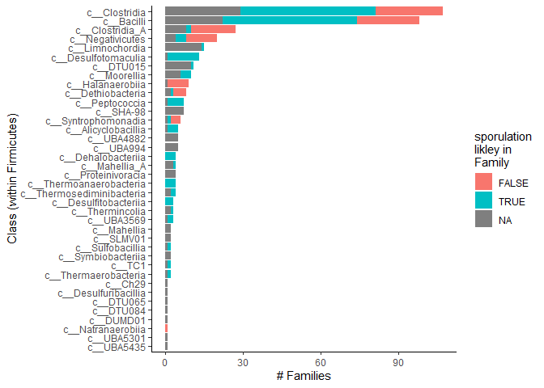

GTDB sporulators
================
Daniel Schwartz
January/2022

# The Goal

We would like to test if sporulation genes found in phages are enriched
among phages that infect hosts that can sporulate. To this end we need
to define by taxonomy who are the sporulators among the *Firmicutes*.
The taxonomic level we would like to use fro prediction is that of
Family. The taxonomic scheme used in the metagenomic analysis is that of
the [Genome Taxonomy Database (GTDB)](https://gtdb.ecogenomic.org/).

## How do we identify a sporulator?

The most obvious way is to get experimental evidence from culture
analysis through microscopy and/or the presence of cells resistant to
heat, chemicals, etc. [Galperin
2013](https://doi.org/10.1128/microbiolspectrum.TBS-0015-2012) gives a
table with a summary of such data across the *Firmicutes*. See data
below. However this data is limited.

A more generalizable approach is the prediction of sporulation capacity
from genome-wide analysis, with a focus on the presence of predictive
sporulation genes. Such an approach was implemented by [Weller and Wu
2015](https://doi.org/10.1111/evo.12597) and on a more broad scale by
[Browne et al. 2021](https://doi.org/10.1186/s13059-021-02428-6).

The issue with both of these approaches with respect to our goal, is
that sporulation appears to have been lost multiple times within the
*Firmicutes*. This result is that within any taxa (in our case *family*)
of sporulators there are commonly also some non-sporulating members.
Therefore we will try and establish some prediction at the family level
of the likelihood of sporulation (likelihood used here to mean best
guess, not in its strict statstical meaning).

# Firmicutes in GTDB

Files will be obtained from the [latest version of
GTDB](https://data.gtdb.ecogenomic.org/releases/latest/).

We will use the genomes listed in the GTDB as Firmicurtes and their
taxonomy. The file which contains this data is the GTDB’s bacterial
metadata file. This is described in **FILE DESCRIPTIONS**:

> Metadata for all bacterial genomes including GTDB and NCBI taxonomies,
> completeness and contamination estimates, assembly statistics, and
> genomic properties.

To download the file I use the *Windows Linux Subsystem* (WSL). This
data cannot be synced by github so it needs to be downloaded at every
machine.

``` r
# make directory
setwd(here())
system(paste("wsl mkdir -p", "gtdb_spor/data/gtdb_downloads"))
setwd(here("gtdb_spor/data/gtdb_downloads"))

# file source
url_latest <- "https://data.gtdb.ecogenomic.org/releases/latest/"

# version
system(paste0("wsl wget ", url_latest,"VERSION"))


# download and extract
system(paste0("wsl wget ", url_latest,"bac120_metadata.tar.gz"))
f_meta <- system(paste0("wsl tar -xzvf ","bac120_metadata.tar.gz"), intern = T)

#delete original file
unlink(here("gtdb_spor/data/gtdb_downloads","bac120_metadata.tar.gz"))

setwd(here())
```

**GTDB version used is v202 Released April 27, 2021.**

### Firmicutes in the GTDB

``` r
f_meta <- list.files(here("gtdb_spor/data/gtdb_downloads"), pattern = "bac120.*tsv")
# read in only Firmicutes

  # function to filter firmicutes by chunks
  f <- function(x, pos) {
    x %>% filter(str_detect(gtdb_taxonomy,
                            regex("Firmicutes", ignore_case = T))) # %>% 
      # select(taxon_cols) 
      
  }
  
  d_meta <-
    read_tsv_chunked(here("gtdb_spor/data/gtdb_downloads", f_meta),
                     DataFrameCallback$new(f))
```

    ## 
    ## -- Column specification --------------------------------------------------------
    ## cols(
    ##   .default = col_character(),
    ##   ambiguous_bases = col_double(),
    ##   checkm_completeness = col_double(),
    ##   checkm_contamination = col_double(),
    ##   checkm_marker_count = col_double(),
    ##   checkm_marker_set_count = col_double(),
    ##   checkm_strain_heterogeneity = col_double(),
    ##   coding_bases = col_double(),
    ##   coding_density = col_double(),
    ##   contig_count = col_double(),
    ##   gc_count = col_double(),
    ##   gc_percentage = col_double(),
    ##   genome_size = col_double(),
    ##   gtdb_representative = col_logical(),
    ##   gtdb_type_species_of_genus = col_logical(),
    ##   l50_contigs = col_double(),
    ##   l50_scaffolds = col_double(),
    ##   longest_contig = col_double(),
    ##   longest_scaffold = col_double(),
    ##   lsu_23s_count = col_double(),
    ##   lsu_5s_count = col_double()
    ##   # ... with 24 more columns
    ## )
    ## i Use `spec()` for the full column specifications.

``` r
# separate taxa levels by GTDB and NCBI for each genome  
d_meta_comp <- d_meta %>% 
    select(accession, gtdb_taxonomy, ncbi_taxonomy) %>% 
    separate(gtdb_taxonomy, sep = ";", into = paste0("gtdb_",c("d","p","c","o","f","g","s"))) %>% 
    separate(ncbi_taxonomy, sep = ";", into = paste0("ncbi_",c("d","p","c","o","f","g","s")))

# list of GTDB firmicutes families
  gtdb_fams <- d_meta_comp %>% 
    select(gtdb_d,gtdb_p,gtdb_c,gtdb_o,gtdb_f) %>% 
    group_by(gtdb_d,gtdb_p,gtdb_c,gtdb_o,gtdb_f) %>%
    summarise(.groups = "drop") 
  

p.gtdb <- gtdb_fams %>% 
    group_by(gtdb_d,gtdb_p,gtdb_c,gtdb_o) %>% 
    summarise(n_families=n(), .groups = "drop") %>% 
  mutate(gtdb_o = fct_reorder(gtdb_o, desc(n_families))) %>% 
    ggplot(aes(gtdb_o, n_families))+
    geom_bar(stat="identity")+
    theme_classic()+
    theme(axis.text.x = element_blank())+
  xlab("Order")
  

# list of NCBI firmicutes families
  ncbi_fams <- d_meta_comp %>% 
    select(ncbi_d,ncbi_p,ncbi_c,ncbi_o,ncbi_f) %>% 
    group_by(ncbi_d,ncbi_p,ncbi_c,ncbi_o,ncbi_f) %>%
    summarise(.groups = "drop") 
  

p.ncbi <- ncbi_fams %>% 
      group_by(ncbi_d,ncbi_p,ncbi_c,ncbi_o) %>% 
    summarise(n_families=n(), .groups = "drop") %>% 
  mutate(tax=paste0(ncbi_p,ncbi_c,ncbi_o)) %>% 
  mutate(tax = fct_reorder(tax, desc(n_families))) %>% 
    ggplot(aes(tax, n_families))+
    geom_bar(stat="identity")+
    theme_classic()+
    theme(axis.text.x = element_blank())+
  xlab("Order")

plot_grid(p.gtdb, p.ncbi, labels = c("GTDB", "NCBI"), ncol = 1, label_x = 0.5, label_y = 0.9)
```

<!-- -->

GTDB has much more taxa levels. Overall GTDB lists 401 families in the
Firmicutes.

## Sporulator status prediticion from Browne et al. 

Data from table S1 from paper that lists prediction of sporulation
ability fro \>1000 Firmicutes genomes. Predictions are based on the
distribution of 66 sporulation genes within families, with special
weight to spo0A (See Browne et al. methods).

``` r
d_browne <- read_csv(here("gtdb_spor/data/Browne_2021_tbl-S1.csv"))
```

    ## New names:
    ## * `` -> ...13
    ## * `` -> ...14
    ## * `` -> ...15
    ## * `` -> ...16

    ## Rows: 1430 Columns: 16

    ## -- Column specification --------------------------------------------------------
    ## Delimiter: ","
    ## chr (7): major taxonomic family/ species name for non-Firmicutes, Firmicutes...
    ## dbl (5): tree order, sporulation signature score %, presence spo0A, spore-fo...
    ## lgl (4): ...13, ...14, ...15, ...16

    ## 
    ## i Use `spec()` to retrieve the full column specification for this data.
    ## i Specify the column types or set `show_col_types = FALSE` to quiet this message.

``` r
#filter out non-firmicutes (have species name in column #2)
d_browne <- d_browne %>% 
  filter(! str_detect(`major taxonomic family/ species name for non-Firmicutes`,
                    " "))


  browne_fams <- d_browne %>% 
    select(order = `Firmicutes taxonomic order/ non-Firmicutes phylum`,
           family = `major taxonomic family/ species name for non-Firmicutes`,
           spore_score = `sporulation signature score %`,
           sporulator = `spore-former characterisation` )

  
  browne_fams %>% 
    mutate(sporulator = as.logical(sporulator)) %>% 
     mutate(family = fct_infreq(family) ) %>% 
    ggplot(aes(family,spore_score ))+
    geom_jitter(aes(fill = sporulator), width = 0.1, shape=21, alpha=0.3)+
    theme_classic()+
    theme(axis.text.x = element_text(angle = 60, hjust = 1))
```

<!-- -->

I will use the family majority to predict sporulation likelihood of a
family.

``` r
browne_fams <- browne_fams %>% 
  select(-spore_score) %>% 
  mutate(sporulator = if_else(sporulator==1, "sporulators","non")) %>% 
  group_by(order, family, sporulator) %>% 
  summarise(n = n()) %>% 
  pivot_wider(names_from = sporulator, values_from = n, values_fill = 0) %>% 
  mutate(total = sporulators + non) %>% # total wxcluding NAs
    mutate(perc_spor = 100*sporulators/total) %>% 
    mutate(fam_spor = perc_spor > 50)
```

    ## `summarise()` has grouped output by 'order', 'family'. You can override using the `.groups` argument.

``` r
browne_fams %>% 
  mutate(family = fct_infreq(family) ) %>%
  ggplot(aes(family, perc_spor+1))+
  geom_col(aes(fill = fam_spor))+
  # geom_point(aes(y=total))+
  facet_grid(~order, scales = "free_x", space = "free_x")+
  theme_classic()+
  theme(axis.text.x = element_blank(),
        legend.position = "bottom")
```

<!-- -->

Add Browne predictions to GTDB families

``` r
gtdb_fams <- 
  browne_fams %>%
    ungroup() %>% 
    select(family, browne_spor=fam_spor) %>% 
    mutate(family = paste0("f__", family)) %>% 
    left_join(gtdb_fams, ., by =  c("gtdb_f" = "family"))

browne_n_pred <- sum(!is.na(gtdb_fams$browne_spor)) %>% as.numeric()
```

Using Browne et al. data we can assign sporulation prediction to 75 of
402 Firmicutes families in GTDB.

## predictions by Galperin

As discussed above, Galperin 2013 has a list of sporulator fraction per
family.

``` r
  # classification of sporulators by Galperin 2013
  d_galperin <- read_csv(here("enrichment/data/Galperin_2013_MicrobiolSpectrum_table2.csv"))
```

    ## Rows: 41 Columns: 4

    ## -- Column specification --------------------------------------------------------
    ## Delimiter: ","
    ## chr (4): class, order, Family, Fraction.spore.forming

    ## 
    ## i Use `spec()` to retrieve the full column specification for this data.
    ## i Specify the column types or set `show_col_types = FALSE` to quiet this message.

``` r
d_galperin
```

    ## # A tibble: 41 x 4
    ##    class   order      Family                 Fraction.spore.forming
    ##    <chr>   <chr>      <chr>                  <chr>                 
    ##  1 Bacilli Bacillales Alicyclobacillaceae    +++                   
    ##  2 Bacilli Bacillales Bacillaceae            ++                    
    ##  3 Bacilli Bacillales Listeriaceae           -                     
    ##  4 Bacilli Bacillales Paenibacillaceae       +++                   
    ##  5 Bacilli Bacillales Pasteuriaceae          +++                   
    ##  6 Bacilli Bacillales Planococcaceae         +                     
    ##  7 Bacilli Bacillales Sporolactobacillaceae  ++                    
    ##  8 Bacilli Bacillales Staphylococcaceae      -                     
    ##  9 Bacilli Bacillales Thermoactinomycetaceae +++                   
    ## 10 Bacilli Bacillales Other                  +                     
    ## # ... with 31 more rows

Galperin lists a 4 level system to describe fraction of sporulators in a
family. The table footnote says this:

> The distribution of sporeformers among the experimentally
> characterized members of the respective family is indicated as
> follows:  
> +++, all (or nearly all) characterized members of the family produce
> spores;  
> ++, a significant fraction of species are sporeformers;  
> +, the family includes some sporeformers;  
> -, no known sporeformers in the family.

We will reduce this to a binary classification, where 2-3 plus signs
indicate a sporulating family.

``` r
d_galperin <- d_galperin %>% 
  mutate(spore.likely = 
           case_when(Fraction.spore.forming == "+++" ~ TRUE,
                                Fraction.spore.forming == "++" ~ TRUE,
                                Fraction.spore.forming == "+" ~ FALSE,
                                Fraction.spore.forming == "-"  ~ FALSE))
```

The next chalenge is that Galperin uses the NCBI taxonomy. To transfer
the information to GTDB taxonomy, I will assign sporulation likelihood
based on NCBI taxonomy in the GTDB metadata.

``` r
#metadata at family level
meta_fams <- 
  d_meta_comp %>%
  select(-accession,-gtdb_g, -gtdb_s, -ncbi_g, -ncbi_s) %>% 
  distinct() %>% 
  # combine order and family for joining
  mutate(order_fam = paste(ncbi_o, ncbi_f, sep = "__"))

#add Galperin sporulation classification
# d_meta_comp <- 
  meta_fams <- 
    d_galperin %>%
    select(order,Family, spore.likely) %>% 
    # adjust to match NCBI family in GTDB metadata
    mutate(order = paste0("o__", order),
           Family = paste0("f__", Family)) %>% 
    mutate(order_fam = paste(order, Family, sep = "__")) %>% 
    left_join(meta_fams, ., by = "order_fam")
  
  # summarize GTDB families with Galperin data
  gtdb_galp_fams <- 
    meta_fams %>% 
    select(gtdb_d,gtdb_p,gtdb_c,gtdb_o,gtdb_f, galperin_spor = spore.likely) %>% 
    group_by(gtdb_d,gtdb_p,gtdb_c,gtdb_o,gtdb_f, galperin_spor) %>%
    summarise(n=n(), .groups = "drop") %>% 
    # filter(! is.na(galperin_spor)) %>% 
    pivot_wider(names_from = galperin_spor, values_from = n, values_fill = 0)
```

``` r
  #add Galperin sporulation classification
  d_meta_galp <-  d_galperin %>%
    select(Family, spore.likely) %>% 
    # adjust to match NCBI family in GTDB metadata
    mutate(Family = paste0("f__", Family)) %>%
    left_join(d_meta_comp,., by = c("ncbi_f" = "Family"))

#call sporulation status by majority of GTDB genomes with predictions
  galp_fams <- d_meta_galp %>% 
    select(gtdb_d,gtdb_p,gtdb_c,gtdb_o,gtdb_f, spore.likely) %>% 
    group_by(gtdb_d,gtdb_p,gtdb_c,gtdb_o,gtdb_f, spore.likely) %>%
    summarise(n = n(), .groups = "drop") %>% 
    pivot_wider(names_from = "spore.likely", values_from = "n", values_fill = 0) %>% 
      mutate(total = `TRUE` + `FALSE`) %>% # total wxcluding NAs
      mutate(perc_spor = 100*`TRUE`/total) %>% 
      mutate(glp_spor = perc_spor > 50) 

  # add Galperin prediction to GTDB families 
  gtdb_fams <- 
    galp_fams %>% 
    select(contains("gtdb"), glp_spor) %>% 
    left_join(gtdb_fams, .)
```

    ## Joining, by = c("gtdb_d", "gtdb_p", "gtdb_c", "gtdb_o", "gtdb_f")

``` r
  # compare Browne and Galperin
  agree <- 
    gtdb_fams %>% 
    filter(!is.na(browne_spor)) %>% 
     filter(!is.na(glp_spor)) %>% 
    filter(glp_spor == browne_spor)
  # agree on 51 families
  
  disagree <- 
    gtdb_fams %>% 
    filter(!is.na(browne_spor)) %>% 
     filter(!is.na(glp_spor)) %>% 
    filter(glp_spor != browne_spor)

  # disagree on 10 families
  
  complement <- 
    gtdb_fams %>% 
    filter(is.na(browne_spor) | is.na(glp_spor)) %>% 
    mutate(b_na = is.na(browne_spor), 
           g_na = is.na(glp_spor),
           both_na = b_na & g_na) %>% 
    filter(!both_na) %>% 
    select(!contains("na"))
  
  # 196 families have predictions from only a single data set
  
  missing <- 
    gtdb_fams %>% 
    filter(is.na(browne_spor)) %>% 
    filter(is.na(glp_spor))
```

``` r
browne_fams %>% 
  mutate(gtdb_f = paste0("f__", family)) %>% 
  filter(gtdb_f %in% disagree$gtdb_f) %>% 
    view()

galp_fams %>% 
  filter(gtdb_f %in% disagree$gtdb_f) %>% 
  view()
```

By manual inspection of the numbers supporting the sporulation call in
each of the taxa in the “disagreed” group I was able to make a call for
all 10. In one case, that of the *Peptoniphilaceae* I was not sure from
the numbers, and decided to call them non sporulators based on table 3
of [Johnson et al 2014](https://doi.org/10.1099/ijs.0.058941-0).

``` r
disagree <- read_csv(here("gtdb_spor/data/disagreed_taxa_calls.csv"))
```

    ## New names:
    ## * `` -> ...6

    ## Rows: 10 Columns: 9

    ## -- Column specification --------------------------------------------------------
    ## Delimiter: ","
    ## chr (5): gtdb_d, gtdb_p, gtdb_c, gtdb_o, gtdb_f
    ## lgl (4): ...6, browne_spor, glp_spor, manual_spor

    ## 
    ## i Use `spec()` to retrieve the full column specification for this data.
    ## i Specify the column types or set `show_col_types = FALSE` to quiet this message.

``` r
gtdb_fams <- left_join(gtdb_fams, disagree)
```

    ## Joining, by = c("gtdb_d", "gtdb_p", "gtdb_c", "gtdb_o", "gtdb_f", "browne_spor", "glp_spor")

## Finalize list

``` r
tax_cols = c("gtdb_d", "gtdb_p", "gtdb_c", "gtdb_o", "gtdb_f")

gtdb_spor <- 
  bind_rows(
  agree %>% select(all_of(tax_cols), f_spor = browne_spor),
  disagree %>% select(all_of(tax_cols), f_spor = manual_spor),
  complement %>%  filter(is.na(browne_spor)) %>% select(tax_cols, f_spor = glp_spor),
  complement %>%  filter(is.na(glp_spor)) %>% select(tax_cols, f_spor = browne_spor),
  missing  %>% select(all_of(tax_cols))
) %>% 
  arrange(gtdb_c, gtdb_o, gtdb_f)
```

    ## Note: Using an external vector in selections is ambiguous.
    ## i Use `all_of(tax_cols)` instead of `tax_cols` to silence this message.
    ## i See <https://tidyselect.r-lib.org/reference/faq-external-vector.html>.
    ## This message is displayed once per session.

``` r
write_csv(gtdb_spor, here("GTDB_spor/data/gtdb_families_sporulation.csv"))

gtdb_spor %>% 
  mutate(gtdb_c = fct_infreq(gtdb_c) %>% fct_rev()) %>% 
  ggplot(aes(gtdb_c)) +
  geom_bar(aes(fill = f_spor))+
  ylab("# Families")+
  xlab("Class (within Firmicutes)")+
  coord_flip()+
  theme_classic()+
  guides(fill = guide_legend(title = "sporulation\nlikley in\nFamily"))
```

<!-- -->
