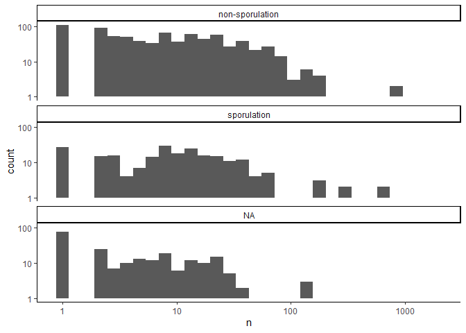

Enrichment GVD
================
Daniel Schwartz
Jan/2022

# Data

## The Gut Virome Database

[Gregory et al. (2020)](https://doi.org/10.1016/j.chom.2020.08.003)
assembled viral population (\~species level genomes) from gut
metagenomes. Host predictions were reported for \~42% of them.

## DRAM-v

(…)

# DRAM Results

## files

*Gregory\_amg\_summary.tsv* – this lists all the putative AMGs in the
viral annotations *Gregory\_vMAG\_stats.tsv* – this gives basic
statistics for each of the viral contigs *Gregory\_SporAMG\_toHost.csv*
– for each virus, this gives the host taxonomy and whether or not it is
a known sporulator (based on taxonomy)

``` r
data_dir <- ("metaG/data/gvd")

d.amg <- read_tsv(here(data_dir, "Gregory_amg_summary.tsv"))
```

    ## 
    ## -- Column specification --------------------------------------------------------
    ## cols(
    ##   gene = col_character(),
    ##   scaffold = col_character(),
    ##   gene_id = col_character(),
    ##   gene_description = col_character(),
    ##   category = col_character(),
    ##   header = col_character(),
    ##   subheader = col_character(),
    ##   module = col_character(),
    ##   amg_flags = col_character()
    ## )

``` r
d.vmag <- read_tsv(here(data_dir, "Gregory_vMAG_stats.tsv"))
```

    ## Warning: Missing column names filled in: 'X1' [1]

    ## 
    ## -- Column specification --------------------------------------------------------
    ## cols(
    ##   X1 = col_character(),
    ##   `VIRSorter category` = col_double(),
    ##   Circular = col_logical(),
    ##   Prophage = col_double(),
    ##   `Gene count` = col_double(),
    ##   `Strand switches` = col_double(),
    ##   `potential AMG count` = col_double(),
    ##   `Transposase present` = col_logical(),
    ##   `Possible Non-Viral Contig` = col_double(),
    ##   `Viral hypothetical genes` = col_double(),
    ##   `Viral genes with unknown function` = col_double(),
    ##   `Viral genes with host benefits` = col_double(),
    ##   `Viral genes with viral benefits` = col_double(),
    ##   `Viral replication genes` = col_double(),
    ##   `Viral structure genes` = col_double()
    ## )

``` r
d.host <- read_csv(here(data_dir, "Gregory_SporAMG_toHost.csv"))
```

    ## Warning: Duplicated column names deduplicated: 'Host_taxonomy' =>
    ## 'Host_taxonomy_1' [3]

    ## 
    ## -- Column specification --------------------------------------------------------
    ## cols(
    ##   vMAG_sporAMG_ID = col_character(),
    ##   Host_taxonomy = col_character(),
    ##   Host_taxonomy_1 = col_character(),
    ##   `Sporulating_Family?` = col_logical()
    ## )

    ## Warning: 8801 parsing failures.
    ##  row                 col           expected actual                                                                          file
    ## 2898 Sporulating_Family? 1/0/T/F/TRUE/FALSE   #N/A 'C:/Users/danschw/GitHub/spore_amg/metaG/data/gvd/Gregory_SporAMG_toHost.csv'
    ## 2899 Sporulating_Family? 1/0/T/F/TRUE/FALSE   #N/A 'C:/Users/danschw/GitHub/spore_amg/metaG/data/gvd/Gregory_SporAMG_toHost.csv'
    ## 2900 Sporulating_Family? 1/0/T/F/TRUE/FALSE   #N/A 'C:/Users/danschw/GitHub/spore_amg/metaG/data/gvd/Gregory_SporAMG_toHost.csv'
    ## 2901 Sporulating_Family? 1/0/T/F/TRUE/FALSE   #N/A 'C:/Users/danschw/GitHub/spore_amg/metaG/data/gvd/Gregory_SporAMG_toHost.csv'
    ## 2902 Sporulating_Family? 1/0/T/F/TRUE/FALSE   #N/A 'C:/Users/danschw/GitHub/spore_amg/metaG/data/gvd/Gregory_SporAMG_toHost.csv'
    ## .... ................... .................. ...... .............................................................................
    ## See problems(...) for more details.

``` r
d.amg %>% 
  filter(!is.na(gene_id)) %>%  #not sure why, but many such rows
  group_by(header, gene_id) %>% 
  summarise(n = n()) %>% #arrange(desc(n))
  mutate(is_sporulation = if_else(
    str_detect(header, regex("sporulation", ignore_case = T)),
    "sporulation", "non-sporulation")) %>% 
  ggplot(aes(n))+
  geom_histogram()+
  facet_wrap(~ is_sporulation, ncol = 1)+
  scale_y_log10()+
  scale_x_log10()+
  theme_classic()
```

    ## `summarise()` has grouped output by 'header'. You can override using the `.groups` argument.

    ## `stat_bin()` using `bins = 30`. Pick better value with `binwidth`.

    ## Warning: Transformation introduced infinite values in continuous y-axis

    ## Warning: Removed 26 rows containing missing values (geom_bar).

<!-- -->

Add host status

``` r
# Check for matching column
#any(!d.amg$scaffold %in% d.host$vMAG_sporAMG_ID) # FALSE

#there are many hosts outside the Firmicutes that are not assigned
# a sporulator status (should all be non-sporulating)
d.host %>% 
  filter(!str_detect(Host_taxonomy, 
                     regex("p__Firmicutes", ignore_case = T)))%>% 
  filter(is.na(`Sporulating_Family?`)) %>% view()

#adding non-sporulator to all non-Firmicutes
d.host <- d.host %>% 
  mutate(`Sporulating_Family?` = if_else(
    str_detect(Host_taxonomy,regex("p__Firmicutes", ignore_case = T)),
    `Sporulating_Family?`, FALSE
  )) 

d.amg_host <- 
  d.host %>% 
  select(scaffold = vMAG_sporAMG_ID, Host_taxonomy,
         spore_likely = `Sporulating_Family?`) %>% 
  left_join(d.amg, . , by = "scaffold") %>% 
  # remove genes for which host is unknown
  filter(!str_detect(Host_taxonomy,"Host Not Assigned")) %>% 
  #remove genes for which there is uncertainty on host sporuation
  filter(!is.na(spore_likely)) 
```

# Enrichment

``` r
#significance threshold
p.signif <- 1e-3

#list of sporulation genes
spor_genes <- read_csv(here("spor_gene_list", "data", "dram_spore_genes.csv"))
```

    ## 
    ## -- Column specification --------------------------------------------------------
    ## cols(
    ##   gene_id.ko = col_character(),
    ##   gene_id.uniref90 = col_character(),
    ##   gene_description = col_character(),
    ##   module = col_character(),
    ##   sheet = col_character(),
    ##   header = col_character(),
    ##   subheader = col_character(),
    ##   potential_amg = col_logical(),
    ##   strain = col_character()
    ## )

``` r
# summarise per gene occurence in sporulators and non-sporulators
d.stat <- 
  d.amg_host %>% 
  filter(!is.na(gene_id)) %>%  
  group_by(gene_id, spore_likely) %>% 
  summarise(n=n(), .groups = "drop") %>% 
  pivot_wider(values_from = n, names_from = spore_likely, values_fill = 0) %>% 
  #adjust column names
  rename(sporulator.host = `TRUE`, nonsporulator.host = `FALSE`) %>% 
  # sporulation gene
  mutate(spor_gene = if_else(gene_id %in% spor_genes$gene_id.ko,
         "sporulation_gene", "other"))
  
duplicated(d.stat$gene_id) %>% which() %>% d.stat[.,] %>% view()

# q : the number of white balls drawn without replacement from an urn which contains both black and white balls.
  # AMG in viruses infecting sporulators
# m :the number of white balls in the urn.
  # number of viruses infecting sporulators in the pool
m.gvd <- sum(d.amg_host$spore_likely,na.rm = T)
# n :the number of black balls in the urn.
  # number of viruses infecting non-sporulators in the pool
n.gvd <- sum(!d.amg_host$spore_likely,na.rm = T)
# k: the number of balls drawn from the urn, hence must be in 0,1,., m+n.
  # Total AMG detected in viruses

d.stat <- d.stat %>% 
  mutate(M = m.gvd, 
         N = n.gvd, 
         K = nonsporulator.host + sporulator.host) %>% 
  mutate(p.val = phyper(q = sporulator.host,
                        m = M, n = N, k = K, lower.tail = F, log.p = F))

d.stat$adj.p <- p.adjust(d.stat$p.val, method = "BH")
d.stat$sig <- d.stat$adj.p < p.signif  


#plot
# add labels to genes significantly enriched with K>10
d.stat <- 
spor_genes %>% 
  group_by(gene_id.ko) %>% 
  summarise(n_spor_gene =n(), spor_description = paste(gene_description, collapse = ",")) %>% 
  left_join(d.stat, ., by = c("gene_id" = "gene_id.ko")) %>% 
  mutate(print.lab = sig & K > 8) %>%
  mutate(lab = if_else(spor_gene=="sporulation_gene",
                       paste0(gene_id, "(",n_spor_gene,")"), gene_id)) %>% 
  mutate(lab = if_else(print.lab, lab, "")) 


p <- d.stat %>% 
    ggplot(aes(K,-log10(adj.p+1e-24)))+
  geom_hline(yintercept = -log10(p.signif), linetype=2, color="grey", size = 1)+
  geom_vline(xintercept = 8, linetype=2, color="grey", size = 1)+

  geom_text_repel(aes(label = lab), max.overlaps=50)+
  
  geom_jitter(aes(fill = print.lab),width = 0.005, height = 0.005,
              shape=21, size=3, stroke = 1, alpha = 0.5, show.legend = F)+
  # scale_y_log10()+
  # scale_x_log10()+
  theme_classic()+
  facet_wrap(~ spor_gene, ncol = 1) +
  panel_border(color = "black")+
  scale_x_continuous(trans = "log2", breaks = (2^(0:11)))+
  xlab("Sample size\nNo. homologs detected (log2)")+
  ylab("Enrichment (-log10 adj. P-value)")+
  theme(axis.text.x = element_text(angle = 90, vjust = 0.5, hjust = 1))
  

ggsave(p, filename = here("metaG/plots", "enrich_gvd.png"), width = 6, height = 6)
p  
```

<!-- -->

**export data**

``` r
d.stat %>% 
  arrange(desc(spor_gene), desc(print.lab), adj.p) %>% 
write_csv(. , here("metaG","data","gvd_enrich.csv"))
```
