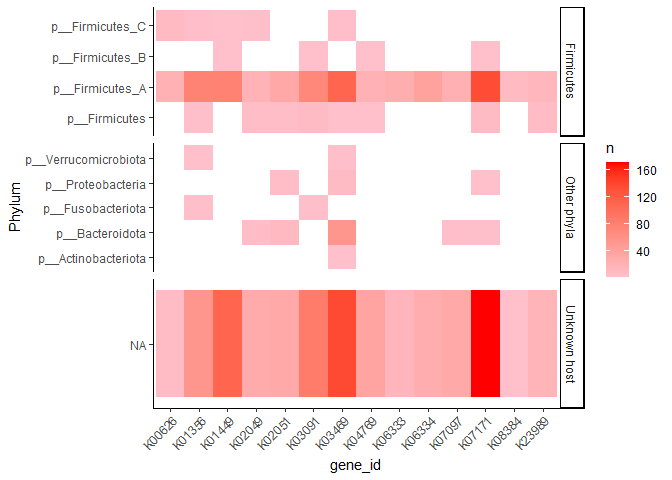

Enriched\_gvd
================
Daniel Schwartz
Jan/2022

Looking at the list of genes from the GVD enrichment analysis

Load the data

``` r
d.enriched <- read_csv(here("metaG","data","gvd_enrich.csv"))
```

    ## 
    ## -- Column specification --------------------------------------------------------
    ## cols(
    ##   gene_id = col_character(),
    ##   nonsporulator.host = col_double(),
    ##   sporulator.host = col_double(),
    ##   spor_gene = col_character(),
    ##   M = col_double(),
    ##   N = col_double(),
    ##   K = col_double(),
    ##   p.val = col_double(),
    ##   adj.p = col_double(),
    ##   sig = col_logical(),
    ##   n_spor_gene = col_double(),
    ##   spor_description = col_character(),
    ##   print.lab = col_logical(),
    ##   lab = col_character()
    ## )

``` r
d.enriched %>% 
  mutate(signif_sample = (adj.p<1e-3) & (K>8)) %>% 
  mutate(enriched = if_else(signif_sample, "enriched", "not enriched")) %>% 
  group_by(spor_gene, enriched) %>% 
  summarise(n=n()) %>% 
  pivot_wider(names_from = enriched, values_from = n)
```

    ## `summarise()` has grouped output by 'spor_gene'. You can override using the `.groups` argument.

    ## # A tibble: 2 x 3
    ## # Groups:   spor_gene [2]
    ##   spor_gene        enriched `not enriched`
    ##   <chr>               <int>          <int>
    ## 1 other                  17            602
    ## 2 sporulation_gene       14            296

# map back to genes

Get gene lists

``` r
bs.genes <- read_csv(here("spor_gene_list/data/dram_spore_genes_RS.csv")) %>% 
  separate(gene_description, into = c("symbol", "description"), sep = ";") %>% 
  rename(ko = gene_id.ko)
```

    ## 
    ## -- Column specification --------------------------------------------------------
    ## cols(
    ##   gene_id.ko = col_character(),
    ##   gene_id.uniref90 = col_character(),
    ##   gene_description = col_character(),
    ##   module = col_character(),
    ##   sheet = col_character(),
    ##   header = col_character(),
    ##   subheader = col_character(),
    ##   potential_amg = col_logical()
    ## )

``` r
cd.genes <- read_csv(here("spor_gene_list/data/cdif_spor_KOs.csv"))
```

    ## Warning: Missing column names filled in: 'X1' [1]

    ## 
    ## -- Column specification --------------------------------------------------------
    ## cols(
    ##   X1 = col_double(),
    ##   strain = col_character(),
    ##   locus_tag = col_character(),
    ##   symbol = col_character(),
    ##   description = col_character(),
    ##   ko = col_character()
    ## )

``` r
# enriched spor KOs
spor.enriched.ko <- 
  d.enriched %>% 
  mutate(signif_sample = (adj.p<1e-3) & (K>8)) %>% 
  # filter(spor_gene!="other") %>% 
  filter(signif_sample) %>% pull(gene_id) %>% unique()

genes_enriched <- 
  bs.genes %>% 
  filter(ko %in% spor.enriched.ko) %>% 
  select(ko , symbol, description ) %>% 
  mutate(sp = "bs")

genes_enriched <-
  cd.genes %>% 
  filter(ko %in% spor.enriched.ko) %>% 
  select(ko , symbol, description ) %>% 
  mutate(sp = "cd") %>% 
  bind_rows(genes_enriched, .)

shared.enriched <- genes_enriched %>% 
  group_by(ko,sp) %>% 
  summarise(n=n()) %>% 
  select(ko, sp) %>% 
  mutate(presence = 1) %>% 
  pivot_wider(names_from = sp, values_from = presence, values_fill = 0) %>% 
  mutate(shared = (bs+cd)>1) %>% 
  filter(shared) %>% 
  pull(ko) %>% 
  unique()
```

    ## `summarise()` has grouped output by 'ko'. You can override using the `.groups` argument.

``` r
genes_enriched %>% 
  filter(ko %in% shared.enriched) 
```

    ## # A tibble: 21 x 4
    ##    ko     symbol description                               sp   
    ##    <chr>  <chr>  <chr>                                     <chr>
    ##  1 K04769 spoVT  stage V sporulation protein T             bs   
    ##  2 K03091 sigH   RNA polymerase sigma-H factor             bs   
    ##  3 K01449 cwlJ   cell wall hydrolase CwlJ                  bs   
    ##  4 K06333 cotJB  spore coat protein CotJB                  bs   
    ##  5 K06334 cotJC  spore coat peptide assembly protein CotJC bs   
    ##  6 K08384 spoVD  stage V sporulation protein D             bs   
    ##  7 K03091 sigE   RNA polymerase sigma-E factor             bs   
    ##  8 K03091 sigG   RNA polymerase sigma-G factor             bs   
    ##  9 K01449 sleB   spore cortex-lytic enzyme                 bs   
    ## 10 K03091 sigF   RNA polymerase sigma-F factor             bs   
    ## # ... with 11 more rows

``` r
# add to amg data frame
d <- genes_enriched %>% 
  # select(-description) %>% 
  mutate(description = str_c(symbol," [",description,"]")) %>% 
  group_by(ko, sp) %>% 
  summarise(genes = str_c(description, collapse = ";")) %>% 
  pivot_wider(names_from = sp, values_from = genes ) %>% 
  left_join(d.enriched %>% filter(gene_id %in% spor.enriched.ko), .,
            by = c("gene_id" = "ko")) %>% 
  filter(spor_gene == "sporulation_gene") 
```

    ## `summarise()` has grouped output by 'ko'. You can override using the `.groups` argument.

``` r
write_csv(d, here("metaG/data/gvd/spor_enriched.csv"))
```

# going back to scaffold data

``` r
data_dir <- ("metaG/data/gvd")

d.amg <- read_tsv(here(data_dir, "Gregory_amg_summary.tsv"))
```

    ## 
    ## -- Column specification --------------------------------------------------------
    ## cols(
    ##   gene = col_character(),
    ##   scaffold = col_character(),
    ##   gene_id = col_character(),
    ##   gene_description = col_character(),
    ##   category = col_character(),
    ##   header = col_character(),
    ##   subheader = col_character(),
    ##   module = col_character(),
    ##   amg_flags = col_character()
    ## )

``` r
d.vmag <- read_tsv(here(data_dir, "Gregory_vMAG_stats.tsv"))
```

    ## Warning: Missing column names filled in: 'X1' [1]

    ## 
    ## -- Column specification --------------------------------------------------------
    ## cols(
    ##   X1 = col_character(),
    ##   `VIRSorter category` = col_double(),
    ##   Circular = col_logical(),
    ##   Prophage = col_double(),
    ##   `Gene count` = col_double(),
    ##   `Strand switches` = col_double(),
    ##   `potential AMG count` = col_double(),
    ##   `Transposase present` = col_logical(),
    ##   `Possible Non-Viral Contig` = col_double(),
    ##   `Viral hypothetical genes` = col_double(),
    ##   `Viral genes with unknown function` = col_double(),
    ##   `Viral genes with host benefits` = col_double(),
    ##   `Viral genes with viral benefits` = col_double(),
    ##   `Viral replication genes` = col_double(),
    ##   `Viral structure genes` = col_double()
    ## )

``` r
d.host <- read_csv(here(data_dir, "Gregory_SporAMG_toHost.csv"))
```

    ## Warning: Duplicated column names deduplicated: 'Host_taxonomy' =>
    ## 'Host_taxonomy_1' [3]

    ## 
    ## -- Column specification --------------------------------------------------------
    ## cols(
    ##   vMAG_sporAMG_ID = col_character(),
    ##   Host_taxonomy = col_character(),
    ##   Host_taxonomy_1 = col_character(),
    ##   `Sporulating_Family?` = col_logical()
    ## )

    ## Warning: 8801 parsing failures.
    ##  row                 col           expected actual                                                                          file
    ## 2898 Sporulating_Family? 1/0/T/F/TRUE/FALSE   #N/A 'C:/Users/danschw/GitHub/spore_amg/metaG/data/gvd/Gregory_SporAMG_toHost.csv'
    ## 2899 Sporulating_Family? 1/0/T/F/TRUE/FALSE   #N/A 'C:/Users/danschw/GitHub/spore_amg/metaG/data/gvd/Gregory_SporAMG_toHost.csv'
    ## 2900 Sporulating_Family? 1/0/T/F/TRUE/FALSE   #N/A 'C:/Users/danschw/GitHub/spore_amg/metaG/data/gvd/Gregory_SporAMG_toHost.csv'
    ## 2901 Sporulating_Family? 1/0/T/F/TRUE/FALSE   #N/A 'C:/Users/danschw/GitHub/spore_amg/metaG/data/gvd/Gregory_SporAMG_toHost.csv'
    ## 2902 Sporulating_Family? 1/0/T/F/TRUE/FALSE   #N/A 'C:/Users/danschw/GitHub/spore_amg/metaG/data/gvd/Gregory_SporAMG_toHost.csv'
    ## .... ................... .................. ...... .............................................................................
    ## See problems(...) for more details.

``` r
# focus on enricched genes
d.amg <- 
  d.amg %>%
  filter(gene_id %in% genes_enriched$ko)

# add host data
d.amg_host <- 
  d.host %>% 
  select(scaffold = vMAG_sporAMG_ID, Host_taxonomy,
         spore_likely = `Sporulating_Family?`) %>% 
  left_join(d.amg, . , by = "scaffold") %>% 
  separate(Host_taxonomy, into = c("d","p","f"), sep = ";", fill = "right")
# %>% 
#   # remove genes for which host is unknown
#   filter(!str_detect(Host_taxonomy,"Host Not Assigned")) %>% 
#   #remove genes for which there is uncertainty on host sporuation
#   filter(!is.na(spore_likely)) 


d.amg_host %>%
  # filter(!is.na(p)) %>% 
  group_by(gene_id,p) %>% 
  summarise(n=n()) %>%
  arrange(desc(n)) %>% 
  # mutate(#gene_id = fct_inorder(gene_id),
  #        p = fct_inorder(p)) %>% 
  mutate(firmi = case_when(
    str_detect(p, "Firmicutes") ~ "Firmicutes",
    is.na(p) ~ "Unknown host",
    TRUE ~"Other phyla")) %>%
  ggplot(aes(gene_id, p))+
  geom_tile(aes(fill = n))+
    facet_grid(firmi ~ ., scales = "free")+
  scale_fill_gradient(low = "pink", high = "red")+
  theme_classic()+
  theme(axis.text.x = element_text(angle = 45, hjust = 1))+
  ylab("Phylum")+
  ggsave2(here("metaG/plots/amg_phyla.png"), width = 6, height = 4)
```

    ## `summarise()` has grouped output by 'gene_id'. You can override using the `.groups` argument.

<!-- -->
