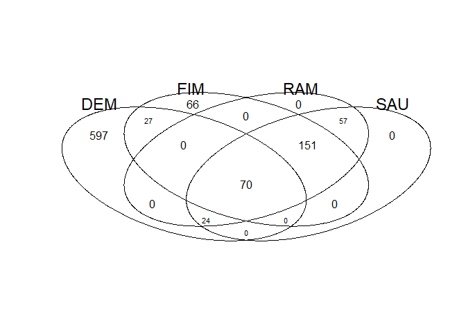

C. difficile sporulation genes
================
Daniel Schwartz
Dec/2021

The goal of this analysis is to generate a list of sporulation genes
from *Clostridioides difficle* to use in DRAM.

# Lists of C. diff sporulation genes

1.  [Fimlaid et al. 2013](https://doi.org/10.1371/journal.pgen.1003660)

> we generated loss-of-function mutations in genes encoding these
> sporulation sigma factors and performed RNA-Sequencing to identify
> specific sigma factor-dependent genes.

Analysis done in strain 630, genes listed with locus_tag (*CD630_NNNN*).

``` r
d.fim <- read_csv(here("spor_gene_list/data", "cdif_Fimlaid_2013_S9.csv" ))
```

    ## Rows: 314 Columns: 3

    ## -- Column specification --------------------------------------------------------
    ## Delimiter: ","
    ## chr (3): Name, locus_tag, description

    ## 
    ## i Use `spec()` to retrieve the full column specification for this data.
    ## i Specify the column types or set `show_col_types = FALSE` to quiet this message.

2.  [Dembek et al. 2015](https://doi.org/10.1128/mBio.02383-14)

These authors made a transposon mutant library in C. difficile epidemic
strain R20291. They then grew library cells in sporulation media and
purified spores. Sporulation genes were those Tn-mutants that were
missing in the spores. In a similar way they also isentifies germination
genes as those absent in a culture grown from purified spores.

Analysis done in strain R20291, genes listed with locus_tag
(*CDR20291_NNNN*). They also list for each gene the ortholog in strain
630, if available. However, they do not mention how orthology was
determined.

``` r
d.dem <- read_csv(here("spor_gene_list/data", "cdif_Dembek_2015_S2.csv" ))
```

    ## Rows: 777 Columns: 5

    ## -- Column specification --------------------------------------------------------
    ## Delimiter: ","
    ## chr (3): locus_tag, function, Cd630 orthologue locus_tag
    ## dbl (2): logFC, q.value

    ## 
    ## i Use `spec()` to retrieve the full column specification for this data.
    ## i Specify the column types or set `show_col_types = FALSE` to quiet this message.

3.  [Ramos-Silva et al. 2019](https://doi.org/10.1101/473793)

> All known sporulation genes from B. subtilis strain 168 and C.
> difficile strain 630, the two species that are better characterized in
> terms of their sporulation machinery, were collected from the
> literature…)

Genes of strain 630 are listed bu GI number. In a separate script
(parse_gi.R) I converted the GI numbers to C. diff 630 locus tags. That
is the list I will use here.

``` r
# d.ramos <- read_csv(here("spor_gene_list/data", "cdif_RamosSilva_2019_S1CD.csv" ))
d.ramos <- read_csv(here("spor_gene_list/data", "giLocus_RamosSilva_.csv" )) %>% 
  # Remove columns created without need
  select(locus_tag, old_locus_tag, product, acc, gi)
```

    ## Rows: 302 Columns: 8

    ## -- Column specification --------------------------------------------------------
    ## Delimiter: ","
    ## chr (5): locus_tag, old_locus_tag, product, acc, note
    ## dbl (1): gi
    ## lgl (2): substrate for methyltransfer, creating the product, (DIM6/NTAB) fam...

    ## 
    ## i Use `spec()` to retrieve the full column specification for this data.
    ## i Specify the column types or set `show_col_types = FALSE` to quiet this message.

4.  [Saujet et al. 2013](https://doi.org/10.1371/journal.pgen.1003756)

These autors constructes mutants in the major regulators of sporulation
(sigma factors EFGK and spoIIID) and compared gene expression between
each mutant abd a WT strain during sporulation (time selected by
preliminary test to maximize differential expression) using microarrays.

Analysis done in strain 630, genes listed with old locus_taga
(*CDNNNN*). To match these I use a gene data table from [Petit et
al. 2014](https://doi.org/10.1186/1471-2164-15-160).

``` r
d.sau <- read_csv(here("spor_gene_list/data", "cdif_Saujet_2013_sup.csv"),
                   trim_ws = T)
```

    ## Rows: 437 Columns: 6

    ## -- Column specification --------------------------------------------------------
    ## Delimiter: ","
    ## chr (5): Gene, symbol, Function, header, mutant.strain
    ## dbl (1): FC

    ## 
    ## i Use `spec()` to retrieve the full column specification for this data.
    ## i Specify the column types or set `show_col_types = FALSE` to quiet this message.

``` r
d.pet <- read_csv(here("spor_gene_list/data", "cdif_Pettit_2014_spo0A.csv" ),
                  trim_ws = T)
```

    ## Rows: 3897 Columns: 10

    ## -- Column specification --------------------------------------------------------
    ## Delimiter: ","
    ## chr (9): old_locus_tag, locus_tag, Gene product, gene name, Functional class...
    ## dbl (1): Functional colour

    ## 
    ## i Use `spec()` to retrieve the full column specification for this data.
    ## i Specify the column types or set `show_col_types = FALSE` to quiet this message.

``` r
d.sau <- d.sau %>% 
  mutate(sub_locus = str_extract(Gene, "\\..*") %>% str_remove("\\.")) 

d.sau <- d.sau %>% 
  mutate(pet_sub_locus =  LETTERS[as.numeric(d.sau$sub_locus)]) %>% 
  mutate(pet_locus = str_replace(Gene, "\\..*", pet_sub_locus)) %>% 
  select(-sub_locus, -pet_sub_locus) 

d.sau <- left_join(d.sau,
          d.pet %>% select(1:2),
          by = c("pet_locus" =  "old_locus_tag"))
```

``` r
library(gplots)
```

    ## 
    ## Attaching package: 'gplots'

    ## The following object is masked from 'package:stats':
    ## 
    ##     lowess

``` r
vn <- venn(list(DEM=d.dem$`Cd630 orthologue locus_tag` %>% unique(),
          FIM=d.fim$locus_tag %>% unique(),
          RAM=d.ramos$locus_tag %>% unique(),
          SAU=d.ramos$locus_tag %>% unique()))
```

<!-- -->

I will include in the list of sporultion genes those that occur in
multiple data sets.

``` r
intersections <- attributes(vn)$intersections
keepers <- names(intersections)
keepers <- keepers[grep(":", keepers)]

spor_genes <- intersections[keepers] %>% unlist()
```

currently 329 genes. I will look at the genes left out to see if any
should be kept.

Which genes occur only in the Dembek data set?

``` r
look <- d.dem %>% 
  filter(`Cd630 orthologue locus_tag` %in% intersections$DEM)

look
```

    ## # A tibble: 656 x 5
    ##    locus_tag     `function`                   logFC  q.value `Cd630 orthologue ~
    ##    <chr>         <chr>                        <dbl>    <dbl> <chr>              
    ##  1 CDR20291_0003 seryl-tRNA synthetase        -3.53 2.97e- 2 CD630_00140        
    ##  2 CDR20291_0004 putative cytosine/adenosin~ -10.8  3.18e- 9 CD630_00150        
    ##  3 CDR20291_0007 recombination protein        -9.64 3.48e- 6 CD630_00180        
    ##  4 CDR20291_0018 putative membrane protein    -9.58 1.39e- 6 CD630_00290        
    ##  5 CDR20291_0020 AraC-family transcriptiona~  -2.82 1.31e-14 CD630_00310        
    ##  6 CDR20291_0025 acetoin:2,6-dichlorophenol~  -7.55 4.01e-13 CD630_00360        
    ##  7 CDR20291_0027 E2 component of acetoin de~  -2.30 1.17e- 7 CD630_00380        
    ##  8 CDR20291_0028 E3 component of acetoin de~  -2.12 4.8 e-15 CD630_00390        
    ##  9 CDR20291_0039 putative dual-specificity ~  -2.68 1.38e-10 CD630_00500        
    ## 10 CDR20291_0050 RNA polymerase sigma-H fac~  -9.89 1.73e-39 CD630_00570        
    ## # ... with 646 more rows

There are two genes that by description are involved in sporulation. I
will keep those in the list.

``` r
look <- look %>% 
  filter(str_detect(`function`, "spore") |
           str_detect(`function`, "sporulation"))

look
```

    ## # A tibble: 2 x 5
    ##   locus_tag     `function`                     logFC  q.value `Cd630 orthologue~
    ##   <chr>         <chr>                          <dbl>    <dbl> <chr>             
    ## 1 CDR20291_3331 putative spore protein         -3.81 4.21e- 4 CD630_34940       
    ## 2 CDR20291_3353 stage V sporulation protein G -11.4  4.38e-11 CD630_35160

``` r
spor_genes <- c(spor_genes, look$`Cd630 orthologue locus_tag`)
```

Which genes occur only in the Fimlaid data set?

``` r
look <- d.fim %>% 
  filter(locus_tag %in% intersections$FIM)

look
```

    ## # A tibble: 66 x 3
    ##    Name   locus_tag   description                                               
    ##    <chr>  <chr>       <chr>                                                     
    ##  1 CD2373 CD630_23730 CstA-like carbon starvation protein                       
    ##  2 murG   CD630_26510 UDP-NAG-NAM-(pentapeptide) pyrophosphoryl-undecaprenol NA~
    ##  3 drm    CD630_12230 phosphopentomutase                                        
    ##  4 CD1824 CD630_18240 P-type calcium transport ATPase                           
    ##  5 CD1404 CD630_14040 oligopeptide transporter                                  
    ##  6 CD3290 CD630_32900 hypothetical protein                                      
    ##  7 CD0145 CD630_01450 S1 RNA-binding domain-containing protein                  
    ##  8 CD0622 CD630_06220 hypothetical protein (DUF1629)                            
    ##  9 CD1222 CD630_12220 integrase site-specific recombinase XerD-like             
    ## 10 prfB   CD630_01440 peptide chain release factor 2 (RF-2)                     
    ## # ... with 56 more rows

Here too there are two genes that by description are involved in
sporulation. I will keep those in the list as well.

``` r
look <- look %>% 
  filter(str_detect(description, "spore") |
           str_detect(description, "sporulation"))

look
```

    ## # A tibble: 2 x 3
    ##   Name   locus_tag   description                          
    ##   <chr>  <chr>       <chr>                                
    ## 1 sigK   CD630_12300 sporulation factor ?K                
    ## 2 CD1045 CD630_10450 sporulation integral membrane protein

``` r
spor_genes <- c(spor_genes, look$locus_tag)
```

Currently I have 333 sporulation genes.

``` r
look <- d.pet %>% 
  filter(! locus_tag %in% spor_genes)

look %>% 
  filter(str_detect(`Gene product`, "spore") |
           str_detect(`Gene product`, "sporulation")) 
```

    ## # A tibble: 17 x 10
    ##    old_locus_tag locus_tag   `Gene product`         `gene name` `Functional cla~
    ##    <chr>         <chr>       <chr>                  <chr>       <chr>           
    ##  1 CD0007        CD630_00070 putative spore protein <NA>        1.8.1           
    ##  2 CD1021        CD630_10210 putative spore coat p~ <NA>        1.8.1           
    ##  3 CD1492        CD630_14920 Two-component sensor ~ <NA>        6.1.2           
    ##  4 CD1579        CD630_15790 Two-component sensor ~ <NA>        6.1.2           
    ##  5 CD1935        CD630_19350 Stage V sporulation p~ spoVS       1.8.1           
    ##  6 CD2035        CD630_20350 putative sporulation ~ <NA>        1.8.1           
    ##  7 CD2273        CD630_22730 putative sporulation ~ <NA>        1.8.1           
    ##  8 CD2492        CD630_24920 Two-component sensor ~ <NA>        1.8.1           
    ##  9 CD2498        CD630_24980 D-alanyl-D-alanine ca~ dacF1       1.8.1           
    ## 10 CD2681        CD630_26810 putative sporulation ~ <NA>        1.8.1           
    ## 11 CD2717        CD630_27170 putative sporulation ~ <NA>        1.8.1           
    ## 12 CD3397        CD630_33970 putative sporulation ~ whiA        1.8.1           
    ## 13 CD3498        CD630_34980 Stage V sporulation p~ spoVB       1.8.1           
    ## 14 CD3548        CD630_35480 putative YaaT-like pr~ <NA>        1.8.1           
    ## 15 CD3671        CD630_36710 Stage 0 sporulation p~ spo0J       1.8.1           
    ## 16 CD3672        CD630_36720 Transcriptional regul~ soj         1.8.1           
    ## 17 CD3673        CD630_36730 putative stage 0 spor~ <NA>        1.8.1           
    ## # ... with 5 more variables: Functional colour <dbl>,
    ## #   Transcriptome p-adj value <chr>,
    ## #   Transcriptome log2fold change in 630?erm?spo0A <chr>,
    ## #   Proteome log2fold change in 630?erm?spo0A <chr>,
    ## #   Mature spore proteome (PMID:19542279) <chr>

``` r
look %>% 
  filter(str_detect(`gene name`, "spo")) 
```

    ## # A tibble: 3 x 10
    ##   old_locus_tag locus_tag   `Gene product`          `gene name` `Functional cla~
    ##   <chr>         <chr>       <chr>                   <chr>       <chr>           
    ## 1 CD1935        CD630_19350 Stage V sporulation pr~ spoVS       1.8.1           
    ## 2 CD3498        CD630_34980 Stage V sporulation pr~ spoVB       1.8.1           
    ## 3 CD3671        CD630_36710 Stage 0 sporulation pr~ spo0J       1.8.1           
    ## # ... with 5 more variables: Functional colour <dbl>,
    ## #   Transcriptome p-adj value <chr>,
    ## #   Transcriptome log2fold change in 630?erm?spo0A <chr>,
    ## #   Proteome log2fold change in 630?erm?spo0A <chr>,
    ## #   Mature spore proteome (PMID:19542279) <chr>

### Check if any other genes were left out

I downloade the reannotated C. Diff 630
([Genbank:CP016318.1](https://www.ncbi.nlm.nih.gov/nuccore/CP016318.1/))
genome as GFF. I will check if any genes that I donot have are noted as
related to sporulation.

``` r
library(ape)
gff <- here("spor_gene_list/data","/Cdiff.gff3")
d <- read.gff(gff)

d.cds <- d %>% filter(type == "CDS") 

d.parse.cds <- tibble()
for(i  in 1:nrow(d.cds[])){
  att <- d.cds$attributes[i]
  d.parse.cds <- 
    tibble(locus_tag = str_extract(att, "locus_tag=.*?;") %>% str_remove(";") %>% str_remove("locus_tag="),
           old_locus_tag = str_extract(att, "corresponds to CD630.*?;") %>% str_remove(";") %>% str_remove("corresponds to"),
           acc = str_extract(att, "Name=.*?;") %>% str_remove(";") %>% str_remove("Name="),
           gene = str_extract(att, "gene=.*?;") %>% str_remove(";") %>% str_remove("gene="),
           product = str_extract(att, "product=.*?;") %>% str_remove(";") %>% str_remove("product=")) %>% 
    bind_rows(d.parse.cds, .)
  
}

d.parse.cds$old_locus_tag <- trimws(d.parse.cds$old_locus_tag)

look <- d.parse.cds %>% 
  filter(! old_locus_tag %in% spor_genes)

look %>% 
  filter(str_detect(product, "spore") |
           str_detect(product, "sporulation")) 
```

    ## # A tibble: 17 x 5
    ##    locus_tag        old_locus_tag acc        gene  product                      
    ##    <chr>            <chr>         <chr>      <chr> <chr>                        
    ##  1 CDIF630erm_00007 CD630_00070   ARE60904.1 <NA>  putative spore protein       
    ##  2 CDIF630erm_00399 CD630_02750   ARE61180.1 splB  spore photoproduct (thymine ~
    ##  3 CDIF630erm_01157 CD630_10210   ARE61930.1 <NA>  putative spore coat protein  
    ##  4 CDIF630erm_01657 CD630_14920   ARE62418.1 <NA>  two-component sensor histidi~
    ##  5 CDIF630erm_01748 CD630_15790   ARE62507.1 <NA>  two-component sensor histidi~
    ##  6 CDIF630erm_02139 CD630_19350   ARE62844.1 spoVS stage V sporulation protein S
    ##  7 CDIF630erm_02257 CD630_20350   ARE62950.1 <NA>  putative sporulation integra~
    ##  8 CDIF630erm_02507 CD630_22730   ARE63194.1 <NA>  putative sporulation integra~
    ##  9 CDIF630erm_02739 CD630_24920   ARE63418.1 <NA>  two-component sensor histidi~
    ## 10 CDIF630erm_02935 CD630_26810   ARE63604.1 <NA>  putative sporulation protein 
    ## 11 CDIF630erm_02975 CD630_27170   ARE63642.1 <NA>  putative sporulation protein 
    ## 12 CDIF630erm_03571 CD630_32710   ARE64222.1 <NA>  Spo0E-like sporulation regul~
    ## 13 CDIF630erm_03702 CD630_33970   ARE64386.1 whiA  putative sporulation transcr~
    ## 14 CDIF630erm_03811 CD630_34980   ARE64491.1 spoVB stage V sporulation protein B
    ## 15 CDIF630erm_03863 CD630_35480   ARE64541.1 <NA>  putative YaaT-like protein i~
    ## 16 CDIF630erm_04000 CD630_36710   ARE64669.1 spo0J stage 0 sporulation protein J
    ## 17 CDIF630erm_04001 CD630_36720   ARE64670.1 soj   sporulation initiation inhib~

There are 17 such genes! I’ll add them to the list.

``` r
spor_genes <- look %>% 
  filter(str_detect(product, "spore") |
           str_detect(product, "sporulation")) %>% 
  pull(old_locus_tag) %>% 
  c(spor_genes,.)
```

This brings me to 350 sporulation genes.

# get KEGG data on C. diff

## Strain 630

In KEGG this strain has the code *cdf*, and taxon number
[*T00487*](https://www.genome.jp/entry/T00487).

``` r
# all kegg genes
raw.kegg.cdf <- keggFind("genes", "cdf:CD630") 
d.kegg.cdf <- raw.kegg.cdf %>% 
  enframe(name = "kegg", value = "kegg.txt") %>% 
  separate(kegg, into = c("strain", "locus_tag"), sep = ":") %>% 
  separate(kegg.txt, into = c("symbol", "description"), sep = ";", fill = "left", extra = "merge") 

# KOs
ko <- keggLink("cdf", "ko")
ko <- enframe(ko, name = "ko", value = "cdf")
ko$cdf <-  str_replace(ko$cdf,pattern = "cdf:",replacement = "")
ko$ko <-  str_replace(ko$ko,pattern = "ko:",replacement = "")

# join
d.kegg.cdf <- left_join(d.kegg.cdf, ko, c("locus_tag" = "cdf"))
```

# sporulation genes with KO

``` r
spore_ko <- d.kegg.cdf %>% 
  filter (locus_tag %in% spor_genes) %>% 
  filter (! is.na(ko))
n.ko <- spore_ko$ko %>% unique() %>% length()
spore_ko
```

    ## # A tibble: 152 x 5
    ##    strain locus_tag   symbol  description                                  ko   
    ##    <chr>  <chr>       <chr>   <chr>                                        <chr>
    ##  1 cdf    CD630_00160 dnaX    " DNA polymerase III subunits gamma and tau" K023~
    ##  2 cdf    CD630_00170 <NA>    "DNA binding protein"                        K097~
    ##  3 cdf    CD630_00470 ispD    " 2-C-methyl-D-erythritol 4-phosphate cytid~ K009~
    ##  4 cdf    CD630_00480 ispF    " 2-C-methyl-D-erythritol 2,4-cyclodiphosph~ K017~
    ##  5 cdf    CD630_01060 cwlD    " Germination-specific N-acetylmuramoyl-L-a~ K014~
    ##  6 cdf    CD630_01190 glmM    " Phosphoglucosamine mutase"                 K034~
    ##  7 cdf    CD630_01200 glmS    " Glucosamine--fructose-6-phosphate aminotr~ K008~
    ##  8 cdf    CD630_01240 spoIID  " Stage II sporulation protein D"            K063~
    ##  9 cdf    CD630_01260 spoIIID " Stage III sporulation protein D"           K062~
    ## 10 cdf    CD630_02510 fliI    " ATP synthase subunit beta FliI"            K024~
    ## # ... with 142 more rows

Finally we are left with 152 Cdiff sporulation genes that correspond to
140 unique KOs.

``` r
d.spore_genes <- d.kegg.cdf %>% filter(locus_tag %in% spor_genes) 


write.csv(spore_ko, here("spor_gene_list/data", "cdif_spor_KOs.csv"))

write.csv(d.spore_genes,here("spor_gene_list/data", "cdif_spor_KEGSs.csv"))
```

#add uniref

Dowloaded from
[UNIPROT](https://www.uniprot.org/uniprot/?query=taxonomy:272563)

``` r
d.uni <- read_csv(here("spor_gene_list/data","cdiff_uniprot.csv"))
```

    ## Rows: 3763 Columns: 5

    ## -- Column specification --------------------------------------------------------
    ## Delimiter: ","
    ## chr (5): Entry, locus_tag, product, synonym, gene

    ## 
    ## i Use `spec()` to retrieve the full column specification for this data.
    ## i Specify the column types or set `show_col_types = FALSE` to quiet this message.

``` r
d.spore_genes <- d.uni %>% 
  select(uniprot.id = Entry, locus_tag) %>% 
  left_join(d.spore_genes,.)
```

    ## Joining, by = "locus_tag"

# Format for DRAM

B. subtilis list of sporulation genes in dram format:

``` r
dram_bsub <- read_csv(here("spor_gene_list/data","dram_spore_genes_RS.csv"))
```

``` r
dram.col.names <- names(dram_bsub)
d.dram <- 
  d.spore_genes%>%
  select(gene_id.ko=ko,
         gene_id.uniref90=uniprot.id,
         gene_description=description) %>% 
  mutate(module="sporulation",
         sheet= "MISC",
         header= "sporulation",
         subheader="sporulation",
         potential_amg="TRUE")

write_csv(d.dram, here("spor_gene_list/data","dram_spore_genes_Cdiff.csv"))
d.dram
```

    ## # A tibble: 350 x 8
    ##    gene_id.ko gene_id.uniref90 gene_description    module sheet header subheader
    ##    <chr>      <chr>            <chr>               <chr>  <chr> <chr>  <chr>    
    ##  1 <NA>       Q18C91           "putative spore pr~ sporu~ MISC  sporu~ sporulat~
    ##  2 K02343     Q18C99           " DNA polymerase I~ sporu~ MISC  sporu~ sporulat~
    ##  3 K09747     Q18CA3           "DNA binding prote~ sporu~ MISC  sporu~ sporulat~
    ##  4 K00991     Q18CD1           " 2-C-methyl-D-ery~ sporu~ MISC  sporu~ sporulat~
    ##  5 K01770     Q18CD3           " 2-C-methyl-D-ery~ sporu~ MISC  sporu~ sporulat~
    ##  6 K01448     Q18CJ4           " Germination-spec~ sporu~ MISC  sporu~ sporulat~
    ##  7 K03431     Q18CL0           " Phosphoglucosami~ sporu~ MISC  sporu~ sporulat~
    ##  8 K00820     Q18CK9           " Glucosamine--fru~ sporu~ MISC  sporu~ sporulat~
    ##  9 K06381     Q18CL6           " Stage II sporula~ sporu~ MISC  sporu~ sporulat~
    ## 10 <NA>       Q18CL5           "putative cell wal~ sporu~ MISC  sporu~ sporulat~
    ## # ... with 340 more rows, and 1 more variable: potential_amg <chr>

<!-- ## Strain R20291  -->
<!-- In KEGG this strain has the code *cdl*, and taxon number [*T00998*](https://www.genome.jp/entry/T00998). -->
<!-- ```{r} -->
<!-- # all kegg genes -->
<!-- raw.kegg.cdl <- keggFind("genes", "cdl:CDR20291")  -->
<!-- d.kegg.cdl <- raw.kegg.cdl %>%  -->
<!--   enframe(name = "kegg", value = "kegg.txt") %>%  -->
<!--   separate(kegg, into = c("strain", "locus_tag"), sep = ":") %>%  -->
<!--   separate(kegg.txt, into = c("symbol", "description"), sep = ";", fill = "left", extra = "merge")  -->
<!-- # KOs -->
<!-- ko <- keggLink("cdl", "ko") -->
<!-- ko <- enframe(ko, name = "ko", value = "cdl") -->
<!-- ko$cdl <-  str_replace(ko$cdl,pattern = "cdl:",replacement = "") -->
<!-- ko$ko <-  str_replace(ko$ko,pattern = "ko:",replacement = "") -->
<!-- # join -->
<!-- d.kegg.cdl <- left_join(d.kegg.cdl, ko, c("locus_tag" = "cdl")) -->
<!-- ``` -->
