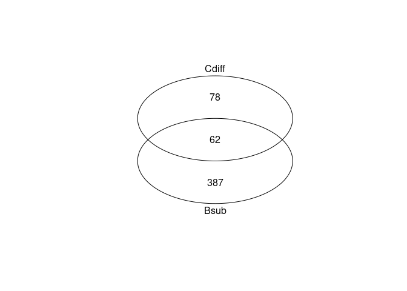

Merge sporulation gene lists (Bsub & Cdiff)
================
Daniel Schwartz
Dec/2021

``` r
library(here)
```

    ## here() starts at /geode2/home/u020/danschw/Carbonate/GitHub/spore_amg

``` r
library(tidyverse)
```

    ## ── Attaching packages ─────────────────────────────────────── tidyverse 1.3.1 ──

    ## ✓ ggplot2 3.3.5     ✓ purrr   0.3.4
    ## ✓ tibble  3.1.2     ✓ dplyr   1.0.6
    ## ✓ tidyr   1.1.3     ✓ stringr 1.4.0
    ## ✓ readr   1.4.0     ✓ forcats 0.5.1

    ## ── Conflicts ────────────────────────────────────────── tidyverse_conflicts() ──
    ## x dplyr::filter() masks stats::filter()
    ## x dplyr::lag()    masks stats::lag()

``` r
library(cowplot)
library(gplots)
```

    ## 
    ## Attaching package: 'gplots'

    ## The following object is masked from 'package:stats':
    ## 
    ##     lowess

# Lists from each strain

``` r
d.bsub <- read_csv(here("spor_gene_list/data", "dram_spore_genes_RS.csv")) %>% 
  mutate(strain = "bs")
```

    ## 
    ## ── Column specification ────────────────────────────────────────────────────────
    ## cols(
    ##   gene_id.ko = col_character(),
    ##   gene_id.uniref90 = col_character(),
    ##   gene_description = col_character(),
    ##   module = col_character(),
    ##   sheet = col_character(),
    ##   header = col_character(),
    ##   subheader = col_character(),
    ##   potential_amg = col_logical()
    ## )

``` r
d.cdiff <- read_csv(here("spor_gene_list/data", "dram_spore_genes_Cdiff.csv")) %>% 
  mutate(strain = "cd")
```

    ## 
    ## ── Column specification ────────────────────────────────────────────────────────
    ## cols(
    ##   gene_id.ko = col_character(),
    ##   gene_id.uniref90 = col_character(),
    ##   gene_description = col_character(),
    ##   module = col_character(),
    ##   sheet = col_character(),
    ##   header = col_character(),
    ##   subheader = col_character(),
    ##   potential_amg = col_logical()
    ## )

``` r
d <- bind_rows(d.bsub, d.cdiff)
```

## KO comparison

``` r
ko.bs <- d.bsub %>% 
  filter(! is.na (gene_id.ko)) %>% 
  pull(gene_id.ko)

ko.cd <- d.cdiff %>% 
  filter(! is.na (gene_id.ko)) %>% 
  pull(gene_id.ko)

venn(list(Bsub = ko.bs %>% unique(),
          Cdiff = ko.cd %>% unique()))
```

<!-- -->

``` r
write_csv(d, here("spor_gene_list/data", "dram_spore_genes.csv"))

unq.ko <- unique(d$gene_id.ko) %>% length()
```

Overall there are 528 unique KO entries that occur in the sporulation
gene list.
