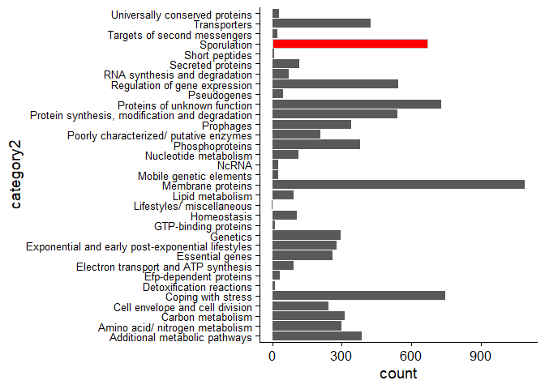
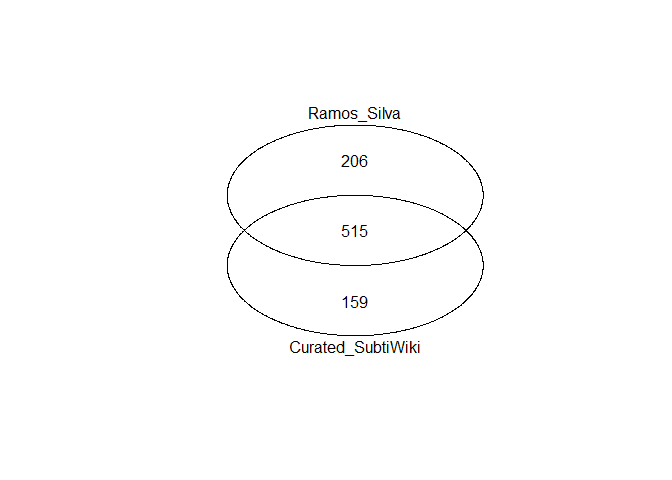
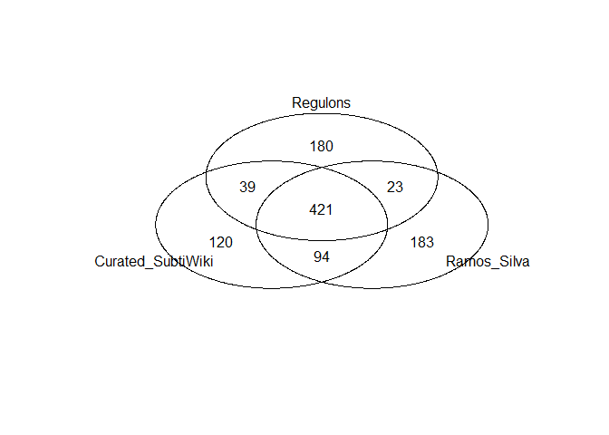

Sporulation Gene List
================
Daniel Schwartz
March/2020

## Sporulation genes

The goal here is to compile an inclusive list of B. subtilis sporulation
genes. We define sporulation genes as those genes that are involved in
the transition into and out of dormancy, that build up the spore or
determine its quality.

### Weller and Wu list

We initially relied on a list of 163 gene used by Weller and Wu
(Evolution 2015), specified in their table S1. Here are the first few
rows from that list:

``` r
d.ww <- read_csv(here("spor_gene_list/data","WW.csv"),
                      col_names = c('acc','gene','function','strain'))
head(d.ww)
```

    ## # A tibble: 6 x 4
    ##   acc      gene  `function`                       strain                        
    ##   <chr>    <chr> <chr>                            <chr>                         
    ## 1 NP_3885~ cotA  spore coat protein A             Bacillus subtilis subsp. subt~
    ## 2 NP_3879~ divIC cell division protein DivIC      Bacillus subtilis subsp. subt~
    ## 3 NP_3880~ kbaA  kinB-signaling pathway activati~ Bacillus subtilis subsp. subt~
    ## 4 NP_3888~ hpr   HTH-type transcriptional regula~ Bacillus subtilis subsp. subt~
    ## 5 NP_3917~ katX  catalase X                       Bacillus subtilis subsp. subt~
    ## 6 NP_3910~ kapB  kinase-associated lipoprotein B  Bacillus subtilis subsp. subt~

## SubtiWiki

This is an *integrated database for the model bacterium Bacillus
subtilis* (Zhu and Stülke, NAR 2018).
<http://subtiwiki.uni-goettingen.de/>  
From there I downloaded a list of all the genes with their associated
categories.

| Primary categories                          |
|:--------------------------------------------|
| SW 1. Cellular processes                    |
| SW 2. Metabolism                            |
| SW 3. Information processing                |
| SW 4. Lifestyles                            |
| SW 5. Prophages and mobile genetic elements |
| SW 6. Groups of genes                       |

| Sporulation primary categories             |
|:-------------------------------------------|
| SW 4.2.1. Sporulation proteins             |
| SW 4.2.2. phosphorelay                     |
| SW 4.2.3. Sporulation/ other               |
| SW 4.2.4. Germination                      |
| SW 4.2.5. Germination/ based on similarity |

With further sub-categories:

| Sporulation secondary categories                                                     |
|:-------------------------------------------------------------------------------------|
| SW 4.2.1.1. Spore coat proteins                                                      |
| SW 4.2.1.2. Spore coat protein/ based on similarity                                  |
| SW 4.2.1.3. Small acid-soluble spore proteins                                        |
| SW 4.2.1.4. Sporulation proteins/ other                                              |
| SW 4.2.1.5. Newly identified sporulation proteins (based on transcription profiling) |
| SW 4.2.2.1. The kinases                                                              |
| SW 4.2.2.2. Proteins controlling the activity of the kinases                         |
| SW 4.2.2.3. The phosphotransferases                                                  |
| SW 4.2.2.4. The ultimate target                                                      |
| SW 4.2.2.5. Phosphatases controlling the phosphorelay                                |
| SW 4.2.2.6. Other protein controlling the activity of the phosphorelay               |
| SW 4.2.4.1. Germinant receptors                                                      |
| SW 4.2.4.2. Additional germination proteins                                          |

### Gene list from SubtiWiki

A list of all the genes and their categories was downloaded from
<http://subtiwiki.uni-goettingen.de/v3/geneCategory/export>. This list
has multiple rows for genes that are associated with multiple
categories. Here are the first few rows of the gene table, and the
distribution by second-tier categories:

| category id | gene       | locus tag | category1          | category2                       | category3           | category4                     | category5 |
|:------------|:-----------|:----------|:-------------------|:--------------------------------|:--------------------|:------------------------------|:----------|
| SW 1.1.1.1  | BSU\_36760 | murAA     | Cellular processes | Cell envelope and cell division | Cell wall synthesis | Biosynthesis of peptidoglycan | NA        |
| SW 1.1.1.1  | BSU\_04570 | murF      | Cellular processes | Cell envelope and cell division | Cell wall synthesis | Biosynthesis of peptidoglycan | NA        |
| SW 1.1.1.1  | BSU\_27670 | spoVB     | Cellular processes | Cell envelope and cell division | Cell wall synthesis | Biosynthesis of peptidoglycan | NA        |
| SW 1.1.1.1  | BSU\_37100 | murAB     | Cellular processes | Cell envelope and cell division | Cell wall synthesis | Biosynthesis of peptidoglycan | NA        |
| SW 1.1.1.1  | BSU\_30050 | murJ      | Cellular processes | Cell envelope and cell division | Cell wall synthesis | Biosynthesis of peptidoglycan | NA        |
| SW 1.1.1.1  | BSU\_15200 | murD      | Cellular processes | Cell envelope and cell division | Cell wall synthesis | Biosynthesis of peptidoglycan | NA        |

<!-- -->
\#\#\# sporulation genes in SubtiWiki

Gathering all genes in sporulation category (SW 4.2). There are **661**
categorical sporulation genes in SubtiWiki.  
Classically, all the genes resulting in asporogeneous mutants are named
*spo* something (e.g. *spo0A*). Let’s make sure these are all included.
Searching for *spo* named genes in the genes not included in in
sporulation category yields a few genes:

``` r
d.non.spore <- d[!d$gene %in% dspore$gene,]
d.non.spore[grep("spo",d.non.spore$`locus tag`),]%>%
  arrange(gene)%>%
  print()
```

    ## # A tibble: 7 x 8
    ##   `category id` gene   `locus tag` category1  category2    category3   category4
    ##   <chr>         <chr>  <chr>       <chr>      <chr>        <chr>       <chr>    
    ## 1 SW 3.3.1.12   BSU_0~ spoVC       Informati~ Protein syn~ Translation Translat~
    ## 2 SW 4.3.1      BSU_0~ spoVC       Lifestyles Coping with~ General st~ <NA>     
    ## 3 SW 6.1        BSU_0~ spoVC       Groups of~ Essential g~ <NA>        <NA>     
    ## 4 SW 3.3.4.4    BSU_0~ spoIIE      Informati~ Protein syn~ Protein mo~ Protein ~
    ## 5 SW 3.4.1.2    BSU_0~ spoIIE      Informati~ Regulation ~ Sigma fact~ Control ~
    ## 6 SW 6.2        BSU_0~ spoIIE      Groups of~ Membrane pr~ <NA>        <NA>     
    ## 7 SW 4.3.17.2   new_1~ spoIISC     Lifestyles Coping with~ Toxins, an~ Type 2 T~
    ## # ... with 1 more variable: category5 <chr>

#### spoVC

According to SubtiWiki *spoVC* is a peptidyl-tRNA hydrolase with a
function in spore coat formation, and is an essential gene. Being
essential, I am not sure how it could have been named a *spo* gene at
all. Menez et al. (2002 Molecular microbiology PMID: 12100553) say that
*A mutation affecting spoVC renders B. subtilis temperature sensitive
for sporulation; at non‐permissive temperature, spo‐285 (Ts) mutant
cells cease sporulation at stage IV to stage V (Young, 1976),
characterized by spore cortex development and coat formation.* They find
that this gene is in fact essential for vegetative growth. I will
include it.

#### spoIIE

SubtiWiki lists this as *protein serine phosphatase, septum-associated
PP2C* whose function is *control of **SigF** activity, required for
normal formation of the asymmetric septum*. According to Gray et
al.(2019 Nat. Comm.) **spoIIE* is one of the first essential sporulation
genes induced by Spo0A, and is not required for other differentiation
processes.* This clearly should be included in the sporulation gene
list.

#### spoIISC

According to SubtiWiki *spoIISC* is an antitoxin. Brantl&Muller (2019
Toxins) say that *the physiological role of the spoIISABC system remains
unknown. Although toxin expression seems to be highest during
sporulation, antitoxin expression is also elevated at the same time.*
taking that together with the potential role of TA systems in
interaction with phages I think we should include this gene.

#### sigE

By chance, I also noticed that sigE (RNA polymerase sporulation mother
cell-specific (early) sigma factor SigE) is not categorized as a
sporulation gene:

``` r
d.non.spore[grep("sigE",d.non.spore$`locus tag`),]%>%
  arrange(gene)%>%
  print()
```

    ## # A tibble: 3 x 8
    ##   `category id` gene   `locus tag` category1   category2   category3   category4
    ##   <chr>         <chr>  <chr>       <chr>       <chr>       <chr>       <chr>    
    ## 1 SW 3.2.1.2    BSU_1~ sigE        Informatio~ RNA synthe~ Transcript~ Sigma fa~
    ## 2 SW 3.4.1.1    BSU_1~ sigE        Informatio~ Regulation~ Sigma fact~ Sigma fa~
    ## 3 SW 6.11       BSU_1~ sigE        Groups of ~ Efp-depend~ <NA>        <NA>     
    ## # ... with 1 more variable: category5 <chr>

I will add it as well.

``` r
# adding 2 spo genes and sigE

d.add <-
  d.non.spore%>%
  filter(`locus tag`=="sigE" |`locus tag`=="spoIISC"|`locus tag`=="spoIIE"|`locus tag`=="spoVC")%>%
  filter(category1=="Information processing"|category1=="Lifestyles")%>%
  filter(category2=="Regulation of gene expression"|category2=="Coping with stress")
dspore <- rbind(dspore,d.add)  
d.add
```

    ## # A tibble: 4 x 8
    ##   `category id` gene    `locus tag` category1  category2  category3   category4 
    ##   <chr>         <chr>   <chr>       <chr>      <chr>      <chr>       <chr>     
    ## 1 SW 3.4.1.1    BSU_15~ sigE        Informati~ Regulatio~ Sigma fact~ Sigma fac~
    ## 2 SW 3.4.1.2    BSU_00~ spoIIE      Informati~ Regulatio~ Sigma fact~ Control o~
    ## 3 SW 4.3.1      BSU_00~ spoVC       Lifestyles Coping wi~ General st~ <NA>      
    ## 4 SW 4.3.17.2   new_13~ spoIISC     Lifestyles Coping wi~ Toxins, an~ Type 2 TA~
    ## # ... with 1 more variable: category5 <chr>

At this point the list of sporulation genes includes **665** genes.

## Compare SubtiWiki with Weller and Wu list

What genes are listed as sporulation gene by Weller&WU and are not on
our SubtiWiki-based list?

``` r
ww.check <- d.ww[!(d.ww$gene%in%dspore$`locus tag`),]
ww.check%>%
  arrange(gene)
```

    ## # A tibble: 18 x 4
    ##    acc     gene   `function`                             strain                 
    ##    <chr>   <chr>  <chr>                                  <chr>                  
    ##  1 YP_003~ 58     spoVAEA stage V sporulation protein AE Bacillus subtilis subs~
    ##  2 NP_387~ abrB   transition state regulatory protein A~ Bacillus subtilis subs~
    ##  3 NP_391~ ald    alanine dehydrogenase                  Bacillus subtilis subs~
    ##  4 NP_389~ ftsA   cell division protein FtsA             Bacillus subtilis subs~
    ##  5 NP_389~ ftsZ   cell division protein FtsZ             Bacillus subtilis subs~
    ##  6 NP_388~ hpr    HTH-type transcriptional regulator Hpr Bacillus subtilis subs~
    ##  7 NP_390~ nucB   sporulation-specific extracellular nu~ Bacillus subtilis subs~
    ##  8 NP_391~ paiA   protease synthase and sporulation neg~ Bacillus subtilis subs~
    ##  9 NP_391~ paiB   protease synthase and sporulation pro~ Bacillus subtilis subs~
    ## 10 NP_388~ phrC   phosphatase RapC inhibitor             Bacillus subtilis subs~
    ## 11 NP_387~ pth    peptidyl-tRNA hydrolase                Bacillus subtilis subs~
    ## 12 NP_390~ sigA   RNA polymerase sigma factor RpoD       Bacillus subtilis subs~
    ## 13 NP_387~ sigH   RNA polymerase sigma-H factor          Bacillus subtilis subs~
    ## 14 NP_390~ sinI   protein SinI                           Bacillus subtilis subs~
    ## 15 NP_390~ sinR   HTH-type transcriptional regulator Si~ Bacillus subtilis subs~
    ## 16 NP_391~ slrR   HTH-type transcriptional regulator Sl~ Bacillus subtilis subs~
    ## 17 NP_391~ spoII~ membrane protein insertase MisCA       Bacillus subtilis subs~
    ## 18 NP_390~ tasA   spore coat-associated protein N        Bacillus subtilis subs~

### Weller and Wu genes to include

-   abrB is a repressor of spo0A.
-   ald is important in linking sporulation-germination “memory” link
    (PMID: 29302032)
-   hpr is scoC in SubtiWiki. “ScoC Mediates Catabolite Repression of
    Sporulation in Bacillus subtilis” (PMID: 14629015). This reminds me
    of some of the enhanced sporulation work of Bramucci. Adding to the
    list.
-   nucB (sporulation-specific extracellular nuclease) is missing in
    SubtiWiki sporulation genes. not sure why. adding it.
-   paiA and paiB are negative regulators of sporulation and I think it
    would be interesting to include them in searches. adding.  
-   phrC is titled a " competence and sporulation factor" in SubtiWiki.
    Adding it.
-   pth is spoVC discussed above.
-   sigH is an activator of several early sporulation genes (PMID:
    12169614 introduction). Adding it.  
-   spoIIIJ is named yidC1 in SubtiWiki and is present.  
-   tasA seems to be a sporulation related gene. (PMID: 10464223). In
    the inclusive spirit I will add it.

``` r
d.add <- d[grep("abrB", d$`locus tag`),]
d.add <- rbind(d.add, d[grep("BSU_31930", d$gene),])
d.add <- rbind(d.add, d[grep("scoC", d$`locus tag`),])
d.add <- rbind(d.add, d[grep("nucB", d$`locus tag`),])
d.add <- rbind(d.add, d[grep("pai", d$`locus tag`),])
d.add <- rbind(d.add, d[grep("phrC", d$`locus tag`),])
d.add <- rbind(d.add, d[grep("sigH", d$`locus tag`),])
d.add <- rbind(d.add, d[grep("tasA", d$`locus tag`),])

d.add <- d.add[!duplicated(d.add$gene),]
dspore <- rbind(dspore,d.add)
# sum(duplicated(dspore$gene))#0
# sum(duplicated(dspore$`locus tag`))#0
d.add
```

    ## # A tibble: 9 x 8
    ##   `category id` gene   `locus tag` category1  category2    category3  category4 
    ##   <chr>         <chr>  <chr>       <chr>      <chr>        <chr>      <chr>     
    ## 1 SW 3.4.6      BSU_0~ abrB        Informati~ Regulation ~ Transitio~ <NA>      
    ## 2 SW 2.3.2.7    BSU_3~ ald         Metabolism Amino acid/~ Utilizati~ Utilizati~
    ## 3 SW 3.4.2.5    BSU_0~ scoC        Informati~ Regulation ~ Transcrip~ Transcrip~
    ## 4 SW 2.5.1      BSU_2~ nucB        Metabolism Nucleotide ~ Utilizati~ <NA>      
    ## 5 SW 2.6.6.6    BSU_3~ paiA        Metabolism Additional ~ Miscellan~ Metabolis~
    ## 6 SW 3.4.2.5    BSU_3~ paiB        Informati~ Regulation ~ Transcrip~ Transcrip~
    ## 7 SW 3.1.7      BSU_0~ phrC        Informati~ Genetics     Genetic c~ <NA>      
    ## 8 SW 3.2.1.2    BSU_0~ sigH        Informati~ RNA synthes~ Transcrip~ Sigma fac~
    ## 9 SW 4.1.2      BSU_2~ tasA        Lifestyles Exponential~ Biofilm f~ <NA>      
    ## # ... with 1 more variable: category5 <chr>

### Weller and Wu genes to exclude

-   spoVAEA is misnamed in WW file and is present in list
-   ftsA and ftsZ form the division Z-ring
-   sigA is the major vegetative sigma-factor
-   sinI and sinIR are inhibitors of sporulation but are homologous to
    phage repressor (PMID: 9799632). slrR similarly has an HTH-cro/C1
    type domain according to its SubtiWiki page. This would possibly
    yield false AMG status but should be looked into. Not adding to
    list.

**List is 674 genes long**

# compare with 2019 Ramos-Silva paper

A list of sporulation genes for *B. subtilis* and *C. dificile* is the
basis for a macro-evolutionary analysis of Firmicutes and sporulation in
a paper by Ramos-Silva et al (2019 MBE PMID: 31350897) titled: “From
Root to Tips: Sporulation Evolution and Specialization in Bacillus
subtilis and the Intestinal Pathogen Clostridioides Difficile”. They say
that "*For this study, we have manually compiled 726 sporulation genes
for B. subtilis strain 168… and 307 sporulation genes from the C.
difficile strain 630.* This is expanded in the methods:

> All known sporulation genes from B. subtilis strain 168 and C.
> difficile strain 630, the two species that are better characterized in
> terms of their sporulation machinery, were collected from the
> literature (Fimlaid et al. 2013; Saujet et al. 2013; Pishdadian et
> al. 2015; Meeske et al. 2016) and SubtiWiki 2.0 (Mäder et al. 2012).
> These included the genes coding for the main regulators of
> sporulation: spo0A—controlling initiation; sigE and sigK—coding for
> the mother cell early and late specific sigma factors; sigF and
> sigG—coding for the early and late forespore-specific sigma factors;
> and the genes under their control (supplementary table S1,
> Supplementary Material online)

Here is the supplementary table for B. subtilis:

``` r
d.rs <- read_csv(here("spor_gene_list/data","RS_bs_list.csv"))

d.rs
```

    ## # A tibble: 721 x 3
    ##    GI           Regulators Regulators2
    ##    <chr>        <chr>      <chr>      
    ##  1 GI:255767207 sigF       <NA>       
    ##  2 GI:255767204 sigE       <NA>       
    ##  3 GI:16079873  sigF       <NA>       
    ##  4 GI:16080099  sigG       <NA>       
    ##  5 GI:16078079  sigE       <NA>       
    ##  6 GI:255767509 sigF       <NA>       
    ##  7 GI:255767506 sigG       <NA>       
    ##  8 GI:16078005  sigE       <NA>       
    ##  9 GI:255767181 sigE       <NA>       
    ## 10 GI:255767182 sigE       <NA>       
    ## # ... with 711 more rows

Ramos-Silva lists 721 sporulation genes, while I have curated a list of
674 genes above.  
To compare the genes I need to translate the GI numbers by Ramos-Silva
into wither BSU numbers or character-based names. I have found a list
for that in the Alignable Tight Genomic Clusters (ATGC) data base at
<http://dmk-brain.ecn.uiowa.edu/ATGC/data/ATGC015/genomes/Bacillus_subtilis_subtilis_str_168.GCF_000009045.1.html>.

``` r
d.atgc <- read_csv(here("spor_gene_list/data","uiowa_atgc.csv"))

# # test that GI are unique
# sum(duplicated(d.rs$GI))#0
# sum(duplicated(d.atgc$GI))#0
# # RS GIs in Iowa GIs?
# nrow(d.atgc[d.atgc$GI %in% d.rs$GI,])#721, all
# nrow(d.rs[!d.rs$GI %in% d.atgc$GI,])#0
# # YES

d.rs <- left_join(d.rs, d.atgc, "GI")

d.rs%>%
  select("GI","Regulators","Regulators2","Gene name / symbol(s)" ,"Locus tag","Product name")%>%
  print()
```

    ## # A tibble: 721 x 6
    ##    GI     Regulators Regulators2 `Gene name / sym~ `Locus tag` `Product name`   
    ##    <chr>  <chr>      <chr>       <chr>             <chr>       <chr>            
    ##  1 GI:25~ sigF       <NA>        yhbA              BSU08910    epoxyqueuosine r~
    ##  2 GI:25~ sigE       <NA>        katA              BSU08820    vegetative catal~
    ##  3 GI:16~ sigF       <NA>        lonB              BSU28210    Lon protease 2   
    ##  4 GI:16~ sigG       <NA>        ytzC              BSU30470    hypothetical pro~
    ##  5 GI:16~ sigE       <NA>        yhgD              BSU10150    TetR family tran~
    ##  6 GI:25~ sigF       <NA>        xerD              BSU23510    tyrosine recombi~
    ##  7 GI:25~ sigG       <NA>        spoVAEB           BSU23402    stage V sporulat~
    ##  8 GI:16~ sigE       <NA>        spoVR             BSU09400    stage V sporulat~
    ##  9 GI:25~ sigE       <NA>        cotJB             BSU06900    spore coat prote~
    ## 10 GI:25~ sigE       <NA>        yesK              BSU06930    hypothetical pro~
    ## # ... with 711 more rows

#### Comparing the list I put together and the Ramos-Silva list for B. subtilis

``` r
library(gplots)
#make rs BSU notation similar to subtiwiki, i.e. add underline
d.rs$gene <- gsub("BSU", "BSU_", d.rs$`Locus tag`)

venn.bsu <- venn(list(Curated_SubtiWiki=dspore$gene, Ramos_Silva=d.rs$gene))
```

<!-- -->

``` r
venn.name <- venn(list(Curated_SubtiWiki=dspore$`locus tag`, Ramos_Silva=d.rs$`Gene name / symbol(s)`))
```

<!-- -->

That is a very big difference! and the differences are inconsistent
between BSU\_num comparisons (top Venn) and character-based names
(bottom Venn).  
Which genes are not included by Ramos-Silva?

``` r
# the venn diageam also yields list of the intersection and differences
# attr(venn.bsu, "intersections")$Curated_SubtiWiki

dspore[dspore$gene %in% attr(venn.bsu, "intersections")$Curated_SubtiWiki,]
```

    ## # A tibble: 159 x 8
    ##    `category id` gene   `locus tag` category1  category2 category3  category4   
    ##    <chr>         <chr>  <chr>       <chr>      <chr>     <chr>      <chr>       
    ##  1 SW 4.2.1.1.4  BSU_1~ cotT        Lifestyles Sporulat~ Sporulati~ Spore coat ~
    ##  2 SW 4.2.1.1.5  BSU_1~ ymaG        Lifestyles Sporulat~ Sporulati~ Spore coat ~
    ##  3 SW 4.2.1.1.7  BSU_1~ cotU        Lifestyles Sporulat~ Sporulati~ Spore coat ~
    ##  4 SW 4.2.1.1.8  BSU_0~ ygaK        Lifestyles Sporulat~ Sporulati~ Spore coat ~
    ##  5 SW 4.2.1.1.8  G8J2-~ cmpA        Lifestyles Sporulat~ Sporulati~ Spore coat ~
    ##  6 SW 4.2.1.1.8  BSU_3~ ywqH        Lifestyles Sporulat~ Sporulati~ Spore coat ~
    ##  7 SW 4.2.1.1.8  BSU_1~ cotC        Lifestyles Sporulat~ Sporulati~ Spore coat ~
    ##  8 SW 4.2.1.1.8  BSU_2~ ypeP        Lifestyles Sporulat~ Sporulati~ Spore coat ~
    ##  9 SW 4.2.1.4    BSU_1~ sprB        Lifestyles Sporulat~ Sporulati~ Sporulation~
    ## 10 SW 4.2.1.4    BSU_2~ sigF        Lifestyles Sporulat~ Sporulati~ Sporulation~
    ## # ... with 149 more rows, and 1 more variable: category5 <chr>

A quick look shows these are genes that should be included in the list.
**sigF is missing from that list!!**

Which genes are not included in my list?

``` r
d.rs%>%
  select("Gene name / symbol(s)" ,"Locus tag","Product name","GI","Regulators","Regulators2")%>%
  filter(d.rs$gene %in% attr(venn.bsu, "intersections")$Ramos_Silva)
```

    ## # A tibble: 206 x 6
    ##    `Gene name / sym~ `Locus tag` `Product name`     GI    Regulators Regulators2
    ##    <chr>             <chr>       <chr>              <chr> <chr>      <chr>      
    ##  1 yhbA              BSU08910    epoxyqueuosine re~ GI:2~ sigF       <NA>       
    ##  2 katA              BSU08820    vegetative catala~ GI:2~ sigE       <NA>       
    ##  3 yhgD              BSU10150    TetR family trans~ GI:1~ sigE       <NA>       
    ##  4 xerD              BSU23510    tyrosine recombin~ GI:2~ sigF       <NA>       
    ##  5 birA              BSU22440    bifunctional prot~ GI:1~ sigE       <NA>       
    ##  6 alkA              BSU01800    DNA-3-methyladeni~ GI:1~ sigE       <NA>       
    ##  7 dnaA              BSU00010    chromosomal repli~ GI:1~ spo0A      <NA>       
    ##  8 yojA              BSU19520    permease YojA      GI:1~ sigK       <NA>       
    ##  9 resA              BSU23150    thiol-disulfide o~ GI:2~ unknown    <NA>       
    ## 10 ybaS              BSU01590    hypothetical prot~ GI:2~ sigE       <NA>       
    ## # ... with 196 more rows

A quick look suggests these are not sporulation genes.

Lets try and naively reconstruct Ramos-Silva’s list from the SubtiWiki
regulation data. I have downloaded the regulation data from the
Regulation item at <http://subtiwiki.uni-goettingen.de/v3/exports>.

``` r
d.regulon <- read_csv(here("spor_gene_list/data","regulations.csv"))
d.regulon
```

    ## # A tibble: 5,938 x 6
    ##    regulon     regulator `regulator locus t~ mode              gene  `locus tag`
    ##    <chr>       <chr>     <chr>               <chr>             <chr> <chr>      
    ##  1 PerR Regul~ PerR      BSU_08730           activation        srfAA BSU_03480  
    ##  2 PerR Regul~ PerR      BSU_08730           activation        srfAD BSU_03520  
    ##  3 PerR Regul~ PerR      BSU_08730           repression        hemD  BSU_28140  
    ##  4 PerR Regul~ PerR      BSU_08730           repression        hemL  BSU_28120  
    ##  5 PerR Regul~ PerR      BSU_08730           activation        srfAC BSU_03510  
    ##  6 PerR Regul~ PerR      BSU_08730           repression        spx   BSU_11500  
    ##  7 PerR Regul~ PerR      BSU_08730           repression        hemA  BSU_28170  
    ##  8 PerR Regul~ PerR      BSU_08730           repression        hemB  BSU_28130  
    ##  9 PerR Regul~ PerR      BSU_08730           repression        mrgA  BSU_32990  
    ## 10 PerR Regul~ PerR      BSU_08730           transcription re~ nrdI  BSU_17370  
    ## # ... with 5,928 more rows

This list has 220 different regulon categories. Bur I think that some
regulons are nested within other ones. E.g. spoIIID is a
*transcriptional regulator (repressor or activator) of a subset of sigma
E-dependent genes*. And , some overlap with sigK regulon, apparently.

``` r
venn(list(
  SpoIIID=d.regulon$`locus tag`[grep("SpoIIID", d.regulon$regulon)],
  sigE=d.regulon$`locus tag`[grep("SigE", d.regulon$regulon)],
  sigK=d.regulon$`locus tag`[grep("SigK", d.regulon$regulon)]  ))
```

<!-- -->

``` r
# venn(list(
#   sigF=d.regulon$`locus tag`[grep("SigF", d.regulon$regulon)],
#   sigG=d.regulon$`locus tag`[grep("SigG", d.regulon$regulon)],
#   sigE=d.regulon$`locus tag`[grep("SigE", d.regulon$regulon)],
#   sigK=d.regulon$`locus tag`[grep("SigK", d.regulon$regulon)],
#   spo0A=d.regulon$`locus tag`[grep("Spo0A", d.regulon$regulon)]))%>%
d.reg.spore <- 
d.regulon%>%
  filter(grepl("SigF", d.regulon$regulon)|
          grepl("SigG", d.regulon$regulon)|
          grepl("SigE", d.regulon$regulon)|
          grepl("SigK", d.regulon$regulon)|
          grepl("Spo0A", d.regulon$regulon)
         )%>%
  filter(!duplicated(`locus tag`))
d.reg.spore
```

    ## # A tibble: 663 x 6
    ##    regulon      regulator `regulator locus tag` mode         gene  `locus tag`
    ##    <chr>        <chr>     <chr>                 <chr>        <chr> <chr>      
    ##  1 SigK Regulon SigK      BSU_25760             sigma factor cotF  BSU_40530  
    ##  2 SigK Regulon SigK      BSU_25760             sigma factor ymaG  BSU_17310  
    ##  3 SigK Regulon SigK      BSU_25760             sigma factor yrzN  BSU_26559  
    ##  4 SigK Regulon SigK      BSU_25760             sigma factor ykzR  BSU_13799  
    ##  5 SigK Regulon SigK      BSU_25760             sigma factor yotF  BSU_19900  
    ##  6 SigK Regulon SigK      BSU_25760             sigma factor ylbE  BSU_14980  
    ##  7 SigK Regulon SigK      BSU_25760             sigma factor cgeC  BSU_19770  
    ##  8 SigK Regulon SigK      BSU_25760             sigma factor yisZ  BSU_10910  
    ##  9 SigK Regulon SigK      BSU_25760             sigma factor yodH  BSU_19600  
    ## 10 SigK Regulon SigK      BSU_25760             sigma factor gerPE BSU_10680  
    ## # ... with 653 more rows

``` r
venn_3way <- venn(list(Curated_SubtiWiki=dspore$gene, Ramos_Silva=d.rs$gene, Regulons=d.reg.spore$`locus tag`))
```

<!-- -->

Which genes are specific to my curated list? (Venn shows 120)

``` r
dspore[dspore$gene %in% attr(venn_3way, "intersections")$Curated_SubtiWiki,]
```

    ## # A tibble: 120 x 8
    ##    `category id` gene   `locus tag` category1  category2 category3 category4    
    ##    <chr>         <chr>  <chr>       <chr>      <chr>     <chr>     <chr>        
    ##  1 SW 4.2.1.1.8  BSU_0~ ygaK        Lifestyles Sporulat~ Sporulat~ Spore coat p~
    ##  2 SW 4.2.1.1.8  BSU_3~ ywqH        Lifestyles Sporulat~ Sporulat~ Spore coat p~
    ##  3 SW 4.2.1.1.8  BSU_2~ ypeP        Lifestyles Sporulat~ Sporulat~ Spore coat p~
    ##  4 SW 4.2.1.5    BSU_3~ yuzL        Lifestyles Sporulat~ Sporulat~ Newly identi~
    ##  5 SW 4.2.1.5    BSU_2~ yppC        Lifestyles Sporulat~ Sporulat~ Newly identi~
    ##  6 SW 4.2.1.5    BSU_1~ ymfD        Lifestyles Sporulat~ Sporulat~ Newly identi~
    ##  7 SW 4.2.1.5    BSU_2~ ypeQ        Lifestyles Sporulat~ Sporulat~ Newly identi~
    ##  8 SW 4.2.1.5    BSU_4~ yycQ        Lifestyles Sporulat~ Sporulat~ Newly identi~
    ##  9 SW 4.2.1.5    BSU_1~ yjzK        Lifestyles Sporulat~ Sporulat~ Newly identi~
    ## 10 SW 4.2.1.5    BSU_3~ yugF        Lifestyles Sporulat~ Sporulat~ Newly identi~
    ## # ... with 110 more rows, and 1 more variable: category5 <chr>

Many of the genes belong to a category of *Newly identified sporulation
proteins (based on transcription profiling)*. But there are all sorts of
genes in there.

Which genes in the regulon based list are not on my list or Ramos-Silva?
(Venn shows 180)

``` r
d.atgc%>%
  select("Gene name / symbol(s)","Product name","Locus tag" )%>%
  filter( gsub("BSU", "BSU_",d.atgc$`Locus tag`) %in% 
            attr(venn_3way, "intersections")$Regulons)%>%
  filter(!duplicated(`Locus tag`))%>%
  arrange(`Locus tag`)
```

    ## # A tibble: 175 x 3
    ##    `Gene name / symbol(~ `Product name`                              `Locus tag`
    ##    <chr>                 <chr>                                       <chr>      
    ##  1 yaaE                  glutamine amidotransferase subunit PdxT     BSU00120   
    ##  2 xpaC                  5-bromo 4-chloroindolyl phosphate hydrolys~ BSU00250   
    ##  3 yaaN                  hypothetical protein                        BSU00260   
    ##  4 yaaO                  hypothetical protein                        BSU00270   
    ##  5 metS                  methionine--tRNA ligase                     BSU00380   
    ##  6 yabD                  deoxyribonuclease YabD                      BSU00390   
    ##  7 yabM                  hypothetical protein                        BSU00570   
    ##  8 yabN                  hypothetical protein                        BSU00580   
    ##  9 yabO                  hypothetical protein                        BSU00590   
    ## 10 tilS                  tRNA(ile)-lysidine synthase                 BSU00670   
    ## # ... with 165 more rows

There are 5 missing genes

``` r
attr(venn_3way, "intersections")$Regulons[!attr(venn_3way, "intersections")$Regulons %in% gsub("BSU", "BSU_",d.atgc$`Locus tag`)]
```

    ## [1] "new_2625913_2626090_c" "BSU_misc_RNA_72"       "new_1569226_1569349_c"
    ## [4] "BSU_35609"             "BSU_35610"

The first 3 are ncRNAs and the last 2 are psedogenes.

One gene on this list is *ywzB*. According to SubtiWiki this is a gene
of unknown function that is *expressed early during sporulation in the
forespore* in a sigF dependent manner. It is part of an operon:
*ywzB-spoIIT-murAA*. *spoIIT* is a *co-activator (with SpoIIR) for
triggering SpoIIGA-dependent processing of SigE* and is categorized as a
sporulation gene. Under phenotypes of a mutant for spoIIT it says: \*
mild sporulation defect due to inefficient activation of SigE
<http://www.ncbi.nlm.nih.gov/pubmed/26735940> \* inactivation of spoIIT
reduces sporulation efficiency to 38% that of wild type cells;
abortively disporic <http://www.ncbi.nlm.nih.gov/pubmed/26735940>  
Likely then, ywzB should be considered a sporulation protein.

Another gene on this list is *metS*, a methionyl-tRNA synthetase that is
repressed by *spo0A* and is therefore in its regulon. In general I think
that including all the *spo0a* regulon as sporulation genes is
questionable, being a general post-exponential regulator.

Lets get rid of the spo0A regulon and reassess. Here is the Venn without
spo0a:

``` r
d.regulon%>%
  filter(grepl("SigF", d.regulon$regulon)|
          grepl("SigG", d.regulon$regulon)|
          grepl("SigE", d.regulon$regulon)|
          grepl("SigK", d.regulon$regulon)
         )%>%
  filter(!duplicated(`locus tag`))%>%
  select(`locus tag`)->tmp
  
 venn_3way <-venn(list(Curated_SubtiWiki=dspore$gene, Ramos_Silva=d.rs$gene, Regulons=tmp$`locus tag`))
```

<!-- -->

Now, without spo0A, which genes in the regulon based list are not on my
list r that of Ramos-Silva? (Venn shows 72)

``` r
# d.reg.spore[d.reg.spore$`locus tag` %in% attr(venn_3way, "intersections")$Regulons,]
d.atgc%>%
  select("Gene name / symbol(s)","Product name","Locus tag" )%>%
  filter( gsub("BSU", "BSU_",d.atgc$`Locus tag`) %in% 
            attr(venn_3way, "intersections")$Regulons)%>%
  filter(!duplicated(`Locus tag`))%>%
  arrange(`Locus tag`)
```

    ## # A tibble: 68 x 3
    ##    `Gene name / symbol(~ `Product name`                              `Locus tag`
    ##    <chr>                 <chr>                                       <chr>      
    ##  1 xpaC                  5-bromo 4-chloroindolyl phosphate hydrolys~ BSU00250   
    ##  2 yaaN                  hypothetical protein                        BSU00260   
    ##  3 yaaO                  hypothetical protein                        BSU00270   
    ##  4 yabM                  hypothetical protein                        BSU00570   
    ##  5 yabN                  hypothetical protein                        BSU00580   
    ##  6 yabO                  hypothetical protein                        BSU00590   
    ##  7 tilS                  tRNA(ile)-lysidine synthase                 BSU00670   
    ##  8 hprT                  hypoxanthine-guanine phosphoribosyltransfe~ BSU00680   
    ##  9 ftsH                  ATP-dependent zinc metalloprotease FtsH     BSU00690   
    ## 10 ctsR                  transcriptional regulator CtsR              BSU00830   
    ## # ... with 58 more rows

There are 4 missing genes, 4 of the 5 seen above.

``` r
attr(venn_3way, "intersections")$Regulons[!attr(venn_3way, "intersections")$Regulons %in% gsub("BSU", "BSU_",d.atgc$`Locus tag`)]
```

    ## [1] "new_2625913_2626090_c" "new_1569226_1569349_c" "BSU_35609"            
    ## [4] "BSU_35610"

Only a few of these genes look to me related to sporulation. There are
competence genes, prophage genes, cell wall biosynthesis, all sorts of
stress genes and many hypotheticals. There are also a couple of genes
that may be relevant like *ykzR* (spore-specific glycosyl hydrolase
BSU13799) and *ftsH* (ATP-dependent zinc metalloprotease FtsH BSU00690)
which seems to be involved in the regulation of sporulation initiation
(PMID: 9076729). However I think that I will just give this up.

##### Finalizing the list

Based on the analysis above and on correspondence with Paula Ramos-Silva
I will include in the list of sporulation genes the genes I collected
from SubtiWiki vased on sporulation categories, a few extra genes from
Weller and Wu (but not all), and the genes in the Ramos-Silva list that
were not captured by two former sources (206 extra genes).

``` r
# Putting together the sporulation gene list
# venn(list(Curated_SubtiWiki=dspore$gene, Ramos_Silva=d.rs$gene)))
# setdiff(d.rs$gene, dspore$gene)
d%>%
  filter(gene %in% setdiff(d.rs$gene, dspore$gene))%>%
  filter(!duplicated(gene))%>%
    arrange(gene)
```

    ## # A tibble: 206 x 8
    ##    `category id` gene   `locus tag` category1  category2  category3  category4  
    ##    <chr>         <chr>  <chr>       <chr>      <chr>      <chr>      <chr>      
    ##  1 SW 3.1.1      BSU_0~ dnaA        Informati~ Genetics   DNA repli~ <NA>       
    ##  2 SW 3.1.1      BSU_0~ dnaN        Informati~ Genetics   DNA repli~ <NA>       
    ##  3 SW 2.6.2.12   BSU_0~ pdxS        Metabolism Additiona~ Biosynthe~ Biosynthes~
    ##  4 SW 3.3.1.2    BSU_0~ ksgA        Informati~ Protein s~ Translati~ rRNA modif~
    ##  5 SW 2.4.2.3    BSU_0~ ispE        Metabolism Lipid met~ Biosynthe~ Biosynthes~
    ##  6 SW 2.5.2.1    BSU_0~ purR        Metabolism Nucleotid~ Biosynthe~ Biosynthes~
    ##  7 SW 2.3.1.12   BSU_0~ yabJ        Metabolism Amino aci~ Biosynthe~ Biosynthes~
    ##  8 SW 3.1.5      BSU_0~ mfd         Informati~ Genetics   DNA repai~ <NA>       
    ##  9 SW 1.2.4.12   BSU_0~ ybaS        Cellular ~ Transport~ Transport~ Other tran~
    ## 10 SW 1.1.3.3    BSU_0~ nagZ        Cellular ~ Cell enve~ Cell wall~ Utilizatio~
    ## # ... with 196 more rows, and 1 more variable: category5 <chr>

Add these genes to the sporulation gene list

``` r
d.spore <- 
d%>%
  filter(gene %in% setdiff(d.rs$gene, dspore$gene))%>%
  filter(!duplicated(gene))%>%
    arrange(gene)%>%
  bind_rows(.,dspore)%>%
  arrange(gene)
# sum(duplicated(d.spore$gene))# 0  
write_csv(d.spore, here("spor_gene_list/data","SWxWWxRS_sporulation_genes.csv"))
d.spore
```

    ## # A tibble: 880 x 8
    ##    `category id` gene   `locus tag` category1  category2   category3 category4  
    ##    <chr>         <chr>  <chr>       <chr>      <chr>       <chr>     <chr>      
    ##  1 SW 3.1.1      BSU_0~ dnaA        Informati~ Genetics    DNA repl~ <NA>       
    ##  2 SW 3.1.1      BSU_0~ dnaN        Informati~ Genetics    DNA repl~ <NA>       
    ##  3 SW 4.2.1.5    BSU_0~ yaaC        Lifestyles Sporulation Sporulat~ Newly iden~
    ##  4 SW 2.6.2.12   BSU_0~ pdxS        Metabolism Additional~ Biosynth~ Biosynthes~
    ##  5 SW 4.2.1.1.1  BSU_0~ yaaH        Lifestyles Sporulation Sporulat~ Spore coat~
    ##  6 SW 4.2.1.4    BSU_0~ bofA        Lifestyles Sporulation Sporulat~ Sporulatio~
    ##  7 SW 4.2.1.4    BSU_0~ csfB        Lifestyles Sporulation Sporulat~ Sporulatio~
    ##  8 SW 4.2.2      BSU_0~ yaaT        Lifestyles Sporulation phosphor~ <NA>       
    ##  9 SW 3.4.6      BSU_0~ abrB        Informati~ Regulation~ Transiti~ <NA>       
    ## 10 SW 3.3.1.2    BSU_0~ ksgA        Informati~ Protein sy~ Translat~ rRNA modif~
    ## # ... with 870 more rows, and 1 more variable: category5 <chr>
